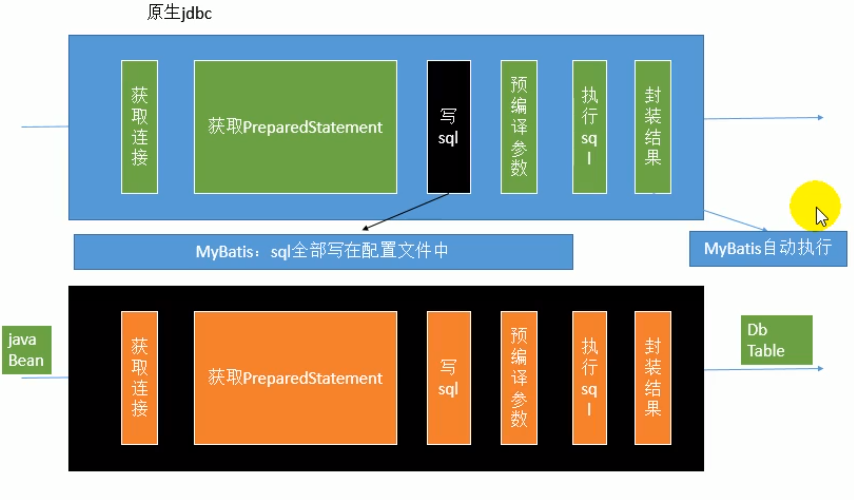
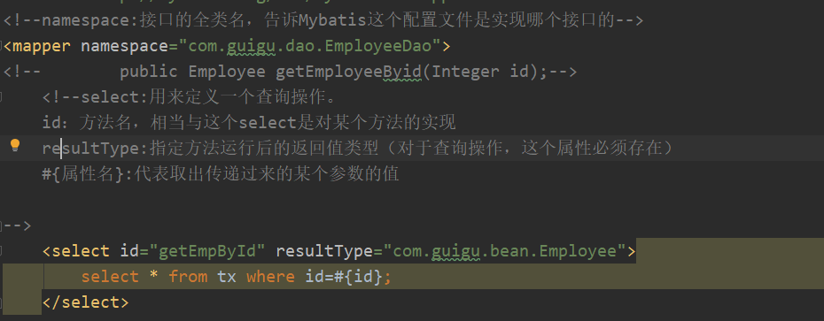
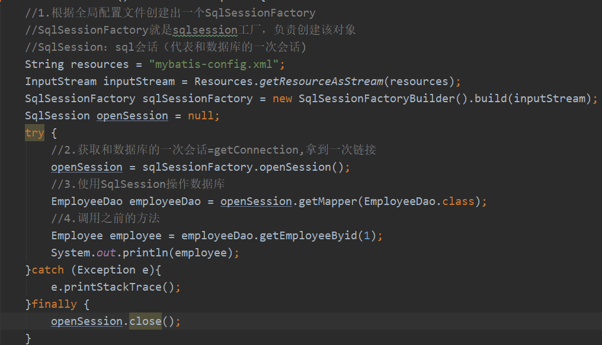

# Mybatis

学习路径

- 第一天：

        Mybatis入门
        Mybatis的概述
        Mybatis的环境搭建Mybatis入门案例
- 第二天：

        自定义Mybatis框架（主要的目的是为了让大家了解 Mybatis中执行细节）
        mybatis基本使用
        mybatis的单表crud操作
        mybatis的参数和返回值
        Mybatis的dao编写
        Mybatis配置的细节
            几个标签的使用
- 第三天：

        Mybatis的深入和多表
        Mybatis的连接池
        Mybatis的事务控制及设计的方法
        Mybatis的多表查询
            一对多（多对一）
            多对多
- 第四天：

        mybatis的缓存和注解开发
        mybatis中的加载时机（查询的时机）
        mybatis中的一级缓存和二级缓存
        Mybatis的注解开发
            单表CRUD
            多表查询

---

# 第一天

- 框架：他是开发中的一套解决方案，不同的框架解决的是不同的问题。
  
  考虑某个领域的整体解决方案，缓存，异常处理，字段映射等
 
- 好处：框架封装了很多的细节，使开发者可以使用极简的方式实现功能，大大提高开发效率。
- Hibernate-数据库交互的框架（ORM框架）（使用各种框架ORM（Object Relation Mapping）对象关系映射；创建好 Java Bean；
        
        缺点
        1）、定制sql
        2）、HQL；SQL；
        3）、全映射框架；部分字段映射很难。

        1）、MyBatis将重要的步骤抽取出来可以人工定制，其他步骤自动化；
        2）、重要步骤都是写在配置文件中（好维护）；
        3）、完全解决数据库的优化问题
        4）、My Batis底层就是对原生JDBC的一个简单封装；
        5）、既将java：编码与sq抽取了出来，还不会失去自动化功能；半自动的持久化层框架

- 三层架构：
  
  表现层：展示数据

  业务层：处理业务需求

  持久层：和数据库交互

  

- 持久层技术解决方案
  
  JDBC：Connection、Preparedstatement、Resultset

  Spring的 JdbcTemplate Spring中对jdbc的简单封装

  Apache的 DBUtils：它和 Spring的JabcTemplate很像，也是对Jdbc的简单封装

以上都不是框架：JDBC是规范。Spring和Apache是工具类。

- Mybatis概述
  
  mybatis是一个持久层框架，Java编写。封装了JDBC操作的细节，开发者只需关注sql本身，无需关注注册驱动，创建链接等。
  
  他使用了ORM(Object relation Mapping)思想：

    将数据库表和实体类及实体类的属性对应起来，实现操作实体类实现操作数据库表。

    user User

    id userId

    user_name userName

    我们需要：实体类中的属性和数据库表的字段名保持一致。

    user User

    id Id

    user_name user_name
- Mybatis 入门
  
  Mybatis的环境搭建

  第一步：创建maven工程并导入坐标

  第二步：创建实体类和dao窗口

  第三步：创建Mybatis的主配置文件 SqlMapConifg.xml

  第四步：创建映射配置文件
  IUserDao.xml

  环境搭建的注意事项：
  
        1.创建IUderDao.xml时和IUserDao.java，命名一致是为了方便理解。实际上在Mybatis中他把持久层的操作接口名称和映射文件叫做Mapper，所以IUserDao和IUserMapper是一样的。
        
        2.Mybatis的映射配置文件位置必须和dao接口的包结构一样。
        
        3.映射配置文件的Mapper标签namespace属性的取值必须是dao接口的全限定类名。

        4.映射配置文件的操作配置，id属性的取值必须是dao接口的方法名。

  当我们遵从了，234点之后，我们在开发中就无需再写dao的实现类。

- Mybatis入门案例

        1.读取配置文件

        2.创建 Sqlsession Factory工厂

        3.创建 SqlSession

        4.创建Dao接口的代理对象

        5.执行dao中的方法

        6.释放资源

注意：不要忘记在映射配置中告知Mybatis要封装到那个实体类中。

配置的方式：指定实体类的全限定类名

- Mybatis基于注解的入门案例

  把 IUserDao.xml移除，在dao接口的方法上使用Select注解，并且指定SQL语句同时需要在 SqlMapConfig.xml中的 mapper配置时，使用 class属性指定dao接口的全限定类

我们在实际开发中，越简便越好，一般采用不写dao实现类的方式，不管时XML或注解配置。
但是Mybatis支持dao实现类

- 详解

1.读取配置文件：绝对路径和相对路径几乎不用。

  使用方法：

  ①.适合用类加载器，只能读取类路径的配置文件

  ②.使用ServletContext对象的getRealPath（）

  2.创建工厂：Mybatis使用了***构建者模式***---builder(in)。优势：把对象的创建细节隐藏，使用者直接调用方法即可。

  3.生产SqlSession使用了**工厂模式**优势：解耦，降低类之间的依赖关系

  4.getMapper，创建Dao接口实现类使用了代理模式：优势，不修改源码的基础上对已有方法增强。

 - 自定义Nybatis的分析

 Mybatis在使用代理dao的方式实现CRUD时做什么？
   1.创建地代理对象

   2.在代理对象中调用selectList
   
   数据库信息，可以创建Connection对象
   
   映射配置信息
  
  可以执行SQL，获取preparedstatement
  。此配置中还有封装的实体类全限定类名和返回类型

**以上使用dom4j技术解析XML**

   
   

- 自定义Mybatis的分析：

  Mybatis在使用代理dao的方式实现增删改查时做什么事。

  第一：创建代理对象 
  
  第二：在代理对象中调用 selectlist
  
  手撕Mybatis视频地址:[手撕Mybatis](https://www.bilibili.com/video/av69586111?p=18)

  # 第二天
- 1、回顾 batis的自定义再分析和环境搭建+完善基于注解的 abatis
- 2、mybatis的curd（基于代理dao的方式）
- 3、mybatis中的参数深入及结果集的深入
- 4、mybatis中基于传统dao的方式（编写dao的实现类）-了解的内容
- 5、mybatis中的配置（主配置文件：SqlmapConfig.xml）

        properties标签
        typeAliases标签
        mappers标签

---
# 雷丰阳版
用 My Batis操作数据库？

1）、导包

        //mysql-connector-java-51 37-bin jar
        //mybatis-3.4.1.jar
        //1og4j-1.2.17.jar
        //建议导入日志包；这样的化在 mybatis关键的环节就会有日志打印；//1og4j（日志框架）；依赖类路径下一个1og4j，xm1配置文件；

2）、写配置（两个，全局配置文件指导mybatis运行，dao接口实现文件，描述dao接口每个方法的工作）

    1）、第一个配置文件；（称为 myatis的全局配置文件，指导 mybatis如何正确运行，比如连接向哪个数据库）
    2）、第二个配置文件：（编写每一个方法都如何向数据库发送sql语句，如何执行。相当于Dao接口的实现类）
        1)、将 mapper的 namespace属性改为接口的全类名
        2）、配置细节
        

        3）、我们写的Dao接口的实现文件，**mybatis默认无法识别的。我们需要在全局配置文件中注册。**
        <mappers>
                 m<mapper resource="EmployeeDao.xml"/>
        </mappers>

3）、测试

        1）、根据全局配置文件先创建一个
        2）、sqlSessionFactory中获取sqlSession对象操作数据库即可

---
如何写XML有提示：
1）、只要IDE找到了文件的dtd(约束文件)的位置，联网会自动下

2）、若没有联网，从jar包中解压出dtd，绑定约束文件。