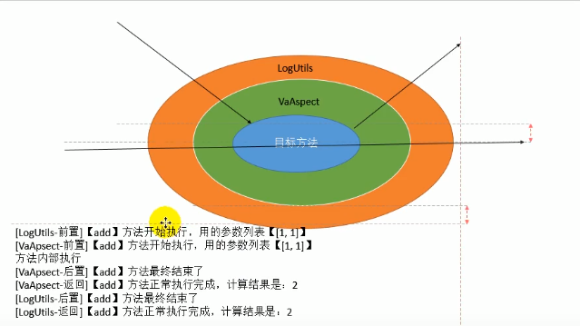
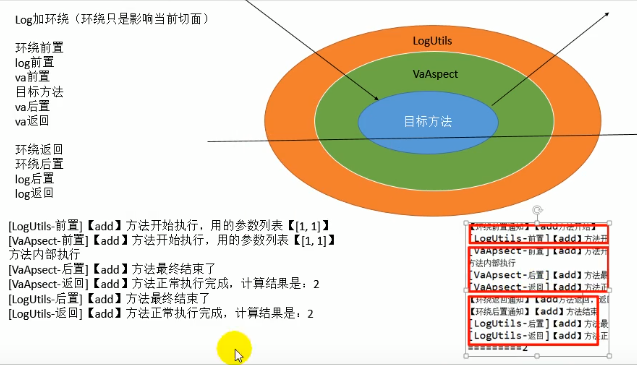
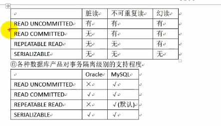
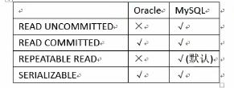

# Spring：容器框架

容器框架，可以管理所有的(类)组件；

核心IOC和AOP；
特性：

    [1]非侵入式。基于Spring开发应用中的对象可以不依赖于Spring的Api
    [2]依赖注入：DI--Dependency Injection，反转控制IOC最经典的实现。
    [3]面向切面编程：Aspect Oriented Programming--AOP
    [4]容器：Spring是一个容器，因为它包含并且管理应用对象的生命周期
    [5]组件化：Spring实现了使用简单的组件配置组合成一个复杂的应用在 Spring中可以使用XML和ava注解组合这些对象。
    [6]一站式：在1OC和AOp的基础上可以整合各种企业应用的开源框架和优秀的第三方类库（实际上 Spring自身也提供了表述层的 SpringMVC和持久层的 Spring JDBC）。

IOC(控制反转):

控制：控制资源的获取方式

    主动式：(自己new资源)
    BookServlet{
        BookServivce bs = new Bookservice();
        AirPlane ap = new AirPlane();//复杂对象对创建时庞大的工程；
    }
    被动式：资源的获取不是我们自己创建，而是交给一个容器来创建。
     BookServlet{
        BookServivce bs
        public void test01(){
            bs.checkout();
        }
     }
**容器**：管理所有的组件(有功能的类)；假设BookServlet受容器管理，BookServlet也受容器管理；容器可以自动的探查出那些组件需要用到另一些组件；容器帮我们创建BookService对象，并把BookService对象赋值过去。

主动的new资源变为被动的接受资源；

**DI**：依赖注入；
容器能知道那个组件运行的时候需要另外一个类；容器通过反射的形式，将容器中准备好的BookService对象注入道BookServlet中；

只要容器管理的组件，都能使用容器提供的功能。

---
HelloWord；
以前自己是new对象，现在所有的对象交给容器创建；***给容器中注册组件***

框架编写流程：

1.导包

使用Maven导入核心薄

2.写配置

spring的配置文件中，集合了Spring的IOC容器管理的所有组件(注册清单)；

创建一个SpringConfig.xml文件

  ***一定记住IDEA必须放在resources中才会编译xml***

## 总结
ioc是一个容器，帮我们管理所有的组件

    1、依赖注入回 Autowired自动赋值

    2、某个组件要使用 Spring提供的更多（I0C、AOP）必须加入到容器中

体会

    1、容器启动。创建所有单实例bean

    2、autowired自动装配的时侯，是从容器中找这些符合要求的bean

    3、ioc.getBean（"bookserylet"）：也是从容器中找到这个bean

    4、容器中包括了所有的bean

    5、调试 spring的源码，容器到底是什么？其实就是一个map

    6.这个map中保存所有创建好的bean，并提供外界获取功能

    7.探索，单实例的bean都保存到哪个map中了。【源码-扩展】

# AOP（Aspect Oriented Programming）
 AOP：(Aspect Oriented Programming)面向切面编程

 OOP：(Object Oriented Programming)面向对象编程

 面向切面编程：基于OOP的新的编程思想；程序运行期间将某段代码动态的切入到指定方法的指定位置进行运行的这种编程方式。

 场景：计算器运行计算方法的时候进行日志记录

 加日志记录：
        
    1.直接编写在方法内部；不推荐，修改维护麻烦。
        日志记录：系统的辅助功能
        业务逻辑：核心功能
    这种方法会导致上俩耦合。
    即便是创建日志工具类，进行日志添加。还是会将日志类的逻辑写入业务逻辑中，导致耦合。
    我们之后 所做的一切就是为了解耦

    2.我们希望的是：
    业务逻辑是核心功能，日志模块在核心功能运行期间，自己动态加上。（动态代理）
可以使用动态代理来讲日志代码动态的在目标方法执行前后进行执行

动态代理得问题：

 jdk默认的动态代理，如果目标对象没有实现任何接口，那么无法为他创建代理对象。

Spring动态代理：Spring实现了AOP功能；底层就是动态代理。

1).可以利用Spring一句代码都不写来创建动态代理。
  
  实现简单，而且不强制要求目标对象必须实现接口。

 将某段代码（日志）动态的切入（不把日志代码写死在业务逻辑方法中）到指定方法（加减乘除）的指定位置(方法的开始.结束等)。这种编程方式就是面向切面编程。

 ---
 AOP专业术语：
 横切关注点：每一个需要执行的方法的都关注”方法开始“的位置，被称为横切关注点。（图画的有点问题，应该是add，sub，mul，div每个方法对应一个横切关注点）

 通知方法：我们在日志工具类中写的方法。

此时这个日志工具类包就是切面类，内部方法为通知方法

---
AOP使用步骤;
1) 导包Maven
2) 写配置：
    
    a.将目标类和前面类(封装了通知方法(在目标方法执行前后执行 的方法))加入到ioc容器中

    b. 还应该告诉Spring到底那个是切面类(使用注解@Aspect)
    
    c. 告诉Spring，切面类里面的每一个方法，都在何时何地运行
    
    还有第五个注解：@Around：环绕
    
    d. 开启基于注解的aop模式
3) 测试

**多切面执行顺序(默认按照字母排序顺序执行)**可以使@Order
通知方法顺序

**加环绕**

***AOP**使用场景：
1. AOP加日志保存到数据库
2. AOP做权限验证
3. AOP做安全检查
4. AOP做事务控制

---
## JDBCTemplate
操作数据库；
Spring提供了JDBCTemplate能快捷的操作数据库。

**环境搭建**
1. 导入sql文件
2. 写几个类和方法模拟结账操作

---
# Spring源码
**Spring-IOC-AOP（动态代理）**

        LogAspectProxy{
            try{
            @ Before 
            method.invoke()//pjp.procced(args){
                BAaspect{//第二个环绕通知(切面)
                     @ Before
                     method.invoke()//--目标方法
                     @AfterReturning
                     //xxxxx.....
                      //若第二个切面修改了返回值，会影响之后的切面
                }
            }
            @AfterReturning
            }catch(e){
                @AfterThrowing
            }finally{
                @After
            }
        }

---
**IOC**：

1. IOC是一个容器
2. 荣启动的时候创建所有单实例对象
3. 我们可以直接从容其中获取到这个对象

SpringIOC：
1. ioc容器的启动过程？启动期间都做了什么（什么时候创建所有单实例bean）
2. ioc是如何创建这些单实例bean，并入和管理的；保存在哪里？

**思路**：

    从HellowWorld开始调试每一个方法：
    1. ClassPathXMLApplicationContext构造器

BeanFactory和 Applicationcontext的区别：
    
       Bean Factory:bean工厂接口；负责创建bean实例；容器里面保存的所有单例bean其实是个map。
     Spring最底层的接口 
       ApplicationContext；是容器接口；更多的负责容器功能的实现；（可以基于 beanFactory创建好的对象之上完成强大的容器）
        容器可以从map中获取这个bean，并且aop，di。在ApplicationContext在下的类中

        BeanFactory是最底层的接口，Application contey留给程序员使用的ioc容器接口

**Spring中最大的模式就是工厂模式**：

<bean class=""></bean>
BeanFactory；bean工厂；工厂模式；帮用户创建bean

---

### 编程式事务：

    Transaction Filter{
        try{
        //获取连接
        设置非自动提交
        chain.doFilter()
        //提交
        }catch(Exception e){
            //回 滚
        }finally{
            //关闭连接释放资源
        }
    }

# 声明式事务：
以前通过复杂的变成编写一个是事务,现在替换为支付要告诉Spring那个方法是事务即可。

**跟AOP极像**：环绕通知可以去做：

    //获取连接
    //设置非自动提交
    目标代码执行
    //正常提交
    //异常回滚
    //最终关闭
最终效果：
    
    BookService{
        @this-a-tx(表明是事务)
        public void checkout(){}

    }

事务管理代码的固定模式作为一种横切关注点，可以通过AOP方法模块化，进而借助 Spring AOP框架实现声式事务管理。

自己要写这个切面还是很麻烦；这个切面己经有了；（事务切面==事务管理器）

事务管理器可以在目标方法运行前后进行方法控制。

实验中我们使用 *DataSourceTransactionManager;*

快速的为某个方法添加事务：

1. 配置事务管理器让他工作
2. 开启基于注解的事务控制模式：依赖于tx名称空间
3. 加注解

### 编译时异常和运行时异常

- 运行时异常：都是**RuntimeException**类及其子类异常，如**NullPointerException**(空指针异常)、**IndexOutOfBoundsException**(下标越界异常)等，这些异常是不检查异常，程序中可以选择捕获处理，也可以不处理。这些异常一般是由程序逻辑错误引起的，程序应该从逻辑角度尽可能避免这类异常的发生。
运行时异常的特点是Java编译器不会检查它，也就是说，当程序中可能出现这类异常，即使没有用try-catch语句捕获它，也没有用throws子句声明抛出它，也会编译通过。
- 非运行时异常 （编译异常）：是**RuntimeException**以外的异常，类型上都属于**Exception类及其子类**。从程序语法角度讲是必须进行处理的异常，如果不处理，程序就不能编译通过。如**IOException、SQLException**等以及用户自定义的Exception异常，一般情况下不自定义检查异常。

#### 事务的隔离级别
JDBC的隔离级别

厂商的支持的隔离级别
