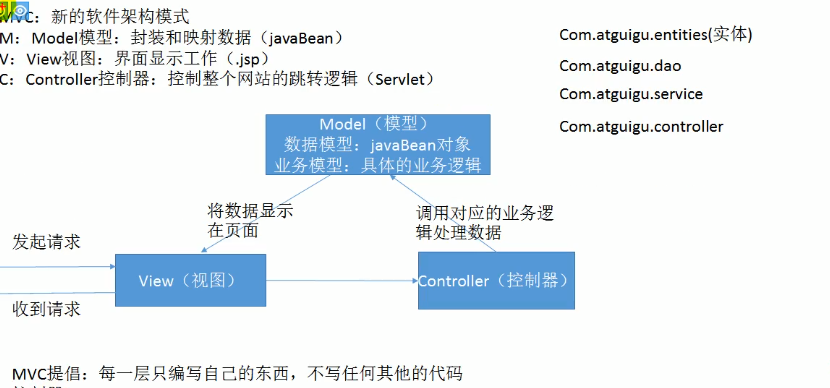
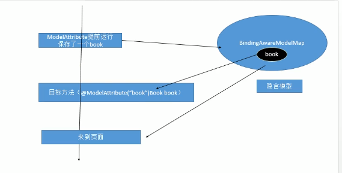
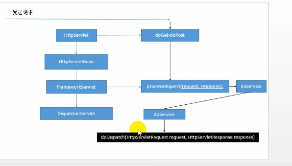
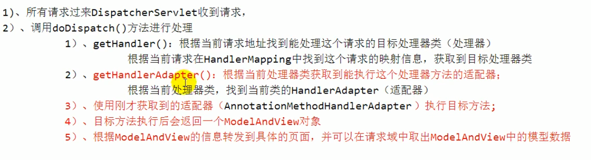
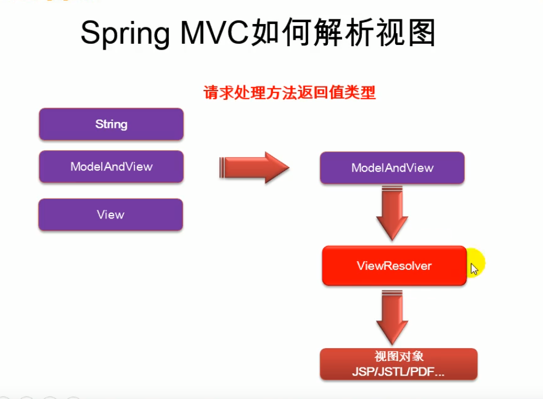

# Spring——MVC
## 简介
1. SpringMVC实现web模块，简化web开发
传统MVC
2. POJO：Plain old Java object；

Springmvc

---
## REST风格
- REST：即 Representational State Transfer。（资源）表现层状态转化。是目前最流行的一种互联网软件架构。它结构清晰、符合标准、易于理解、扩展方便所以正得到越来越多网站的采用
- ***资源（Resources）***：网络上的一个实体，或者说是网络上的一个具体信息。它可以是一段文本、一张图片、一首歌曲、一种服务，总之就是一个具体的存在。可以用一个URI（统一资源定位符）指向它，每种资源对应一个特定的UR|。要获取这个资源，访问它的UR就可以，因此UR即为每一个资源的独一无二的识别符。
-*** 表现层（Representation）***：把资源具体呈现出来的形式，叫做它的表现层
（Representation）。比如，文本可以用txt格式表现，也可以用HTML格式XML格式、JSON格式表现，甚至可以采用二进制格式。
- ***状态转化（State Transfer）***：每发出一个请求，就代表了客户端和服务器的一次交互过程。HTTP协议，是一个无状态协议，即所有的状态都保存在服务器端因此，如果客户端想要操作服务器，必须通过某种手段，让服务器端发生“状态转化”（State Transfer）。而这种转化是建立在表现层之上的，所以就是“表现层状态转化"。具体说，就是HTTP协议里面，四个表示操作方式的动词：GET PoST、PUT、DELETE。它们分别对应四种基本操作：GET用来获取资源POST用来新建资源，PUT用来更新资源，DELETE用来删除资源

REST:希望以非常简洁的URL地址来发请求；

怎样表示对一个资源的增删改查用请求方式来区分

    过去：
    /getBook？id=1：查询图书
    /deletebook？id=1：删除1号图书
    /updateBook？id=1：更新1号图书
    /addBook：添加图书

    REST方式：
    ur地址这么起名；/资源名/资源标识符
    
    /book/1   ：GET--查询1号图书
    /book/1   ：PUT--更新1号图书
    /book/1   ：DELETE-删除1号图书
    /book/1   ：POST---添加图书

    系统的URL地址就REST设计方式；
简洁的URL提交请求，以请求方式区分对资源的操作

**问题**：从页面上只能发起两种请求：GET,POST

其他的请求方式没法使用。

**使用REST风格构建一个增删改查方法**：

## SpringMVC 数据输出
如何将数据输出给页面
 
 
 BindingAwareModelMap隐含模型
 这个Map在mvc中始终存在

 ---

 # SpringMVC源码

 1. 前端控制器的架构。DispatcherServlet；
   
   发送请求
2.    

# 视图解析 springmvc03 
需要看源码
 
