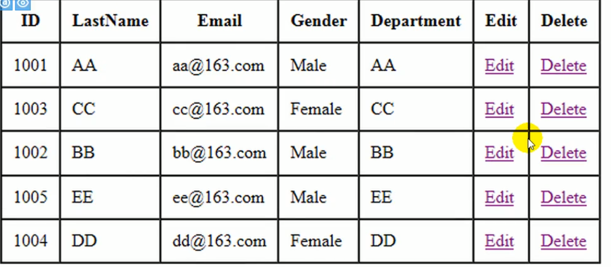
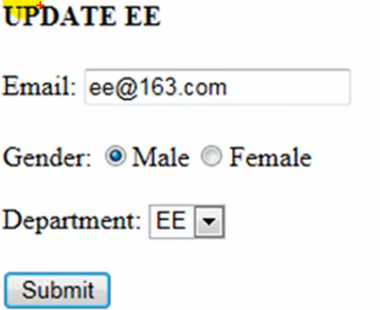
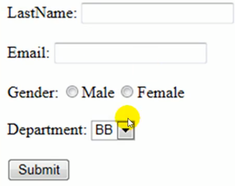
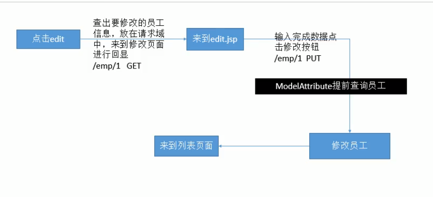
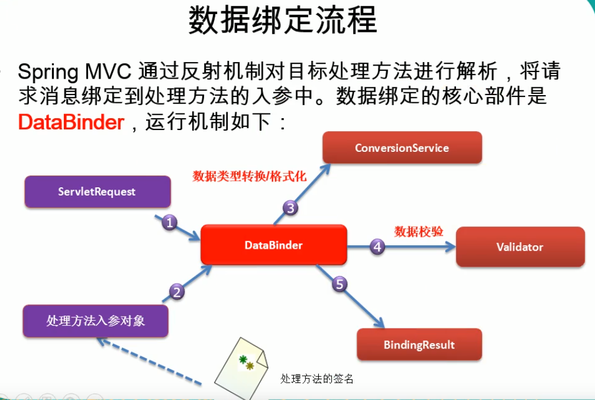
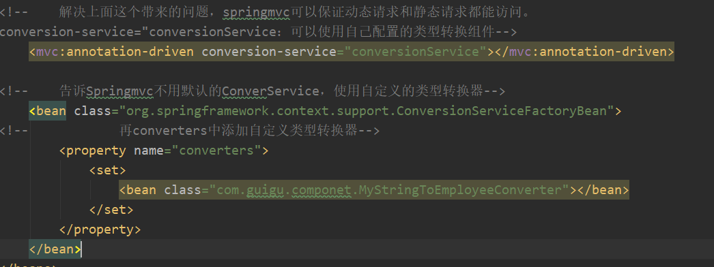
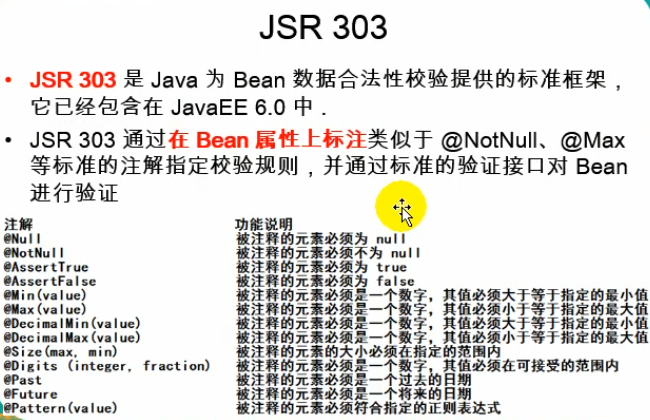
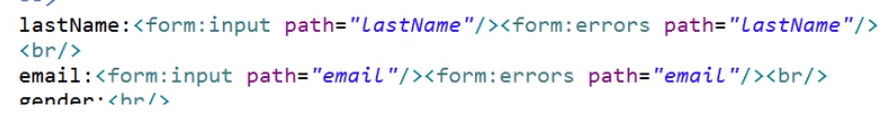

# Spring——MVC
## 简介
1. SpringMVC实现web模块，简化web开发
传统MVC
2. POJO：Plain old Java object；

Springmvc

---
## REST风格
- REST：即 Representational State Transfer。（资源）表现层状态转化。是目前最流行的一种互联网软件架构。它结构清晰、符合标准、易于理解、扩展方便所以正得到越来越多网站的采用
- ***资源（Resources）***：网络上的一个实体，或者说是网络上的一个具体信息。它可以是一段文本、一张图片、一首歌曲、一种服务，总之就是一个具体的存在。可以用一个URI（统一资源定位符）指向它，每种资源对应一个特定的UR|。要获取这个资源，访问它的UR就可以，<font color="red">因此UR即为每一个资源的独一无二的识别符。</font>
-*** 表现层（Representation）***：把资源具体呈现出来的形式，叫做它的表现层
（Representation）。比如，文本可以用txt格式表现，也可以用HTML格式XML格式、JSON格式表现，甚至可以采用二进制格式。
- ***状态转化（State Transfer）***：每发出一个请求，就代表了客户端和服务器的一次交互过程。HTTP协议，是一个无状态协议，即所有的状态都保存在服务器端因此，如果客户端想要操作服务器，必须通过某种手段，让服务器端发生“状态转化”（State Transfer）。而这种转化是建立在表现层之上的，所以就是“表现层状态转化"。具体说，<font color="red">就是HTTP协议里面，四个表示操作方式的动词：GET PoST、PUT、DELETE。它们分别对应四种基本操作：GET用来获取资源POST用来新建资源，PUT用来更新资源，DELETE用来删除资源</font>

REST:希望以非常简洁的URL地址来发请求；

怎样表示对一个资源的增删改查用请求方式来区分

    过去：
    /getBook？id=1：查询图书
    /deletebook？id=1：删除1号图书
    /updateBook？id=1：更新1号图书
    /addBook：添加图书

    REST方式：
    ur地址这么起名；/资源名/资源标识符
    
    /book/1   ：GET--查询1号图书
    /book/1   ：PUT--更新1号图书
    /book/1   ：DELETE-删除1号图书
    /book/1   ：POST---添加图书

    系统的URL地址就REST设计方式；
简洁的URL提交请求，以请求方式区分对资源的操作

**问题**：从页面上只能发起两种请求：GET,POST

其他的请求方式没法使用。

**使用REST风格构建一个增删改查方法**：

## SpringMVC 数据输出
如何将数据输出给页面
 
 
 BindingAwareModelMap隐含模型
 这个Map在mvc中始终存在

 ---

 # SpringMVC源码

 1. 前端控制器的架构。DispatcherServlet；
   
   发送请求
2.    


# 视图解析 springmvc03 
需要看源码
 
## CRUD

做一个符合REST风格的CRUD 

我们使用map模拟数据库

员工列表展示页面： 
员工修改

员工添加：

员工删除-点击完成删除回到列表页面

**REST风格**

增删改查url ：/资源名/资源标识符
    
    /emp/1   ：GET--查询1号员工
    /emp/1   ：PUT--更新1号员工
    /emp/1   ：DELETE-删除1号员工
    /emp     ：POST---添加员工
    /emps    ：查询所有员工

**员工列表展示**：查询所有员工

访问index.jsp--》直接发送/emps---》控制器查询所有员工--》放在请求域model--》转发到list页面展示

**干他娘的，记住使用jstl的时候不要用maven直接下载两个jar包放进去**

**员工添加:**在list页面点击“员工添加”----（查询出所有的部门信息，展示在页面）-来到添加页面(add.jsp)---输入员工数据---点击保存(post /emp)---处理器收到员工保存请求（保存员工）----保存完成以后还是来到列表页面

**员工修改**：按钮
超链接

***<font color="red">Spring MVC 静态资源不显示 css js png 无法访问 配置了mvc:default-servlet-handler 依然不生效</font>***:
静态资源不显示，整了半天发现可能是资源需要重新加载。删除target目录。然后重启server就好了。不删的情况下重启是没用的。

# 数据转换&数据格式化&数据校验
数据绑定流程
- 默认会自动转换类型
- 自定义类型转化
- 
Spring定义了3种类型的转换器接口，实现任意一个转换器接口都可以作为自定义转换器注册到

ConversionServiceFactroyBean中：**一般只用第一种**
-  Converter<S，T>：将S类型对象转为T类型对象
-  ConverterFactory：将相同系列多个“同质"Converter封装在一起如果希望将一种类型的对象转换为另一种类型及其子类的对象
（例如籽 String转换为 Number及 Number子类（Integer、Long、Double等）对象）可使用该转换器工厂类
- GenericConverter：会根据源类对象及目标类对象所在的宿主类中的上下文信息进行类型转换

1.：实现Converter接口，写一个自定义类型转换器。
 
2.：Converter是Conversionservice中的组件；

    (1) 、你的 Converte得放进 Conversionservice中；
    (2)、将 WebDatabinder中的 Conversionservice设置成我们这个加了自定义类型转换器的 Conversionservice；

执行需要写的步骤：

    1） 实现 Converter接口，写一个自定义的类型转换器；
        
    2） 配置出 Conversion Service
  
  3.让SpringMVC使用自定义


**总结**三步：
  
    1）、实现 Converter接口，做—个自定义类型的转换器
    2）、将这个 Converter配置在 ConversionService中
    3）、告诉Springmvc使用这个ConversionService中  


**<mvc：annotation-driven/>注解**：

1、只要请求不好使就召唤mvc：annotation-driven：

    1），<mvc：default-servlet-handler/><mvc：annotation-driven/>
    现象：
      a）、都没配.动态资源（@RequestMapping映射的资源能访间，静态资源（html，js，.img）拒绝）
      b）、加上<mvc：defau1t-serv1et-hand1er/>，不加<mvc：annotation-driven/>。静态资源ok，动态资源完蛋
      c）、加<mvc：defau1t-serv1et-handler/>，也加上<mvc：annotation driven/>：动态资源和静态资源都可以.
      d):只加<mvc：annotation driven/>。静态资源不能访问

## 格式化
使用自定义类型转换器的时候，日期提交格式不正确会报错400。

使用默认类型转换器的时候支持各种日期格式输入。

**如果既要使用自定义类型转换器，又要支持指定的日期格式。** 我们使用FormattingConversionServiceFactoryBean(带有格式化功能)，配置SpringMVC.xml时候，写入上面那个。**（指定格式再日期属性上加DateTimeFormat注解）** 

**数字格式化**：（指定格式，再对应数字属性上加NubmerFormat(pattern="")注解)

## 数据校验

只做前端校验是不安全的
在重要数据一定要加上后端验证

1）、可以写程序将我们每一个数据取出进行校验，如果失败直接来到添加页面，提示其重新填写：x

2）、SpringMVC；可以JSR303来做数据校验.（JavaBean的元素标注注解）

  303是一个规范，所以必须有实现：JSR303的实现是hibernate Validator（第三方校验框架）
  
3）、如何进行快速的后端校验
    1.导入校验jar包 ,带el的jar包不导入，tomcat中本身含有。导入会冲突

    核心包：
    hibernate-validator.0.0. CR2. jar
    hibernate-validator-annotation-processor-5.0.0. CR2.jar
    依赖包：
    classmate-8.8.jar
    jboss-logging-3.1.1.GA.jar
    validation-api -11.0.CR1.jar
  2.只需要给javabean的属性添加上校验注解。

  3.告诉SpringMVC这个javabean需要校验。(添加注解@Valid)

  ```public String addEmp(@valid Employee employee，BindingResult result){}``` 

  4.如何知道校验结果？给需要校验的javabean后面**紧跟**一个BindingResult。这个BingResult就是封装前面一个bean的校验结果（布尔值）。 

  5）、根据不同的校验结果决定怎么办？

  6）、来到风面使用form：errors取出错误信息即可；
  

  ## Ajax
  1. SpringMVC快速完成ajax功能？
     
          1）。返回json就ok;
          2）。页面，&.ajax();
  2. 原生javaweb：
     
          1）.导入GSON包
          2）.返回的数据用GSON转成json
          3).写出去
  1. 对于SpringMVC-ajax来说：
  2. 
          1).导包
            jackson-annotations-2.1.5.jar
            jackson-core-2.1.5.jar
            jackson-databind-2.1.5.jar

          2).写配置
          3).测试