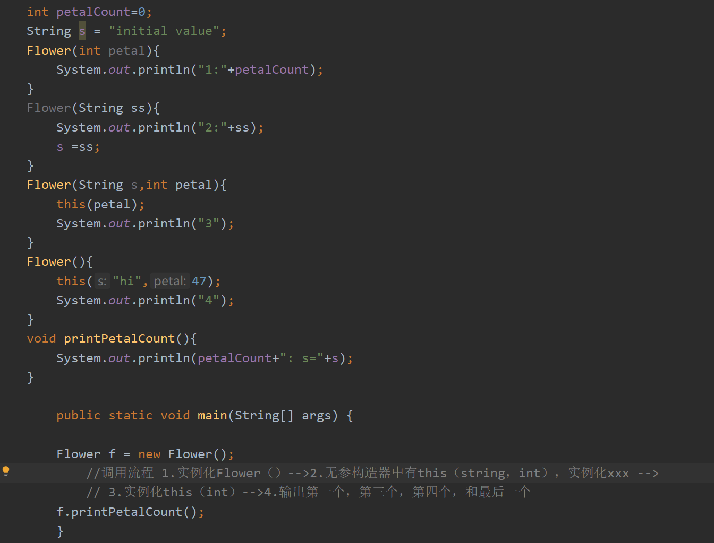

11# 第二章：一切皆是对象

## 2.1 用引用操纵对象

- java一切都是对象，操纵的标识符是对象的一个"引用"。（遥控器--电视机）
- 拥有一个引用，并不一定需要有一个对象与其关联。（String s;）此时，创建了一个引用而非对象，无法向s发送消息，s没有与任何事物关联。创建一个引用同时初始化（String s = "ssssdf";）

## 2.2 必须有你创建所有对象

- 用**new**操作符实现新对象的关联：（String s = **new** String("abc");
   $(# 这行代码究竟创建了几个String对象呢）$
   
   答：一个或两个

    - 首先在堆中（不是常量池）创建一个指定的对象"abc"，并让s引用指向该对象
    - 在字符串常量池中查看，是否存在内容为"abc"字符串对象
    - 若存在，则将new出来的字符串对象与字符串常量池中的对象联系起来
    - 若不存在，则在字符串常量池中创建一个内容为"abc"的字符串对象，并将堆中的对象与之联系起来

- 寄存器：速度最快，空间最小。
- 栈:在RAM中，通过指针上移，释放资源，下移加入资源，有较大局限性（必须知道所有项的生命周期），一部分java数据存在栈中（对象的引用），但对象不存在栈中
- 堆： 位于RAM中，用于存放java的对象，编译器不需要知道对象存活时间，有较大灵活性。
- 常量存储 常量值直接放在程序代码内部
- 非RAM存储 数据完全存活于程序之外。如，流对象（字节流）和持久化对象（磁盘）。对象可以转化成可以存放在其他媒介上的十五在需要时可以恢复成常规的基于RAM的对象（使用JDBC，Hibernate）

## 2.3 永远不要销毁对象

- 作用域(scope)：
作用域里定义的变量只可作用于作用域结束之前。Java不允许将一个较大作用域的变量"隐藏"起来的做法。
- 对象的作用域：
Java对象不具备和基本类型一样的生命周期。当用new创建一个Java对象时，它可以存活于作用域之外。
    ```
    String s = new String("xxx");
    ```
    引用s在作用域终点消失，但是s指向的**String**对象任继续占据内存空间。

    并且使用Java垃圾回回收期，来监视用new创建的所有对象，消除内存泄漏问题。

## 2.4 方法、参数和 返回值
Java中的方法只能作为类的一部分来创建。方法只有通过对象才能被调用，且这个对象必须能执行这个方法调用。#（static方法：针对类调用，不依赖于对象存在）

参数列表指定要传递给方法什么样的信息。在参数列表中必须指定$\color{red}{每个所传递对象的类型及名字}$，并且与Java中任何传递对象的场合一样，传递的实际上是 ***对象的引用***。

static关键字：
    
    1.只想为某特定域分配单一空间，而不考虑究竟创建多少对象，甚至可以不创建对象
    2.希望某个方法不与包含它的那个类的任何对象关联在一起

当声明一个static类时，表示该域或方法不会与包含他的哪个类的任何对象实例关联。$\color{green}{即使从未创建某哥类的任何对象或方法，也可以调用其static方法或访问域}$

```
class StaticTest{
    static int i = 1;
}

StaticTest t1 = new StaticTest();
StaticTest t2 = new StaticTest();
```
创建了两个static对象，但是t1.i与t2.i共享同一份空间（验证hashcode一致）即指向相同。

引用static变量：1.通过对象定位
2.通过类名直接引用，对于非静态成员不可。如
```
t1.i++;//由于共享空间，改变之后静态变量值全变，t1，t2都+1
```

# 操作符
 - ！=和==比较的是对象的引用。若想比较对象的实际内容是否相同必须使用：equals()/此方法不适用于基本类型。
  
    $\color{red}{equals()方法的默认行为是比较'引用'，若比较基本类型会出现错误，使用前必须重写equals()}$（不过大多数类库已经实现重写操作）
- 在Java中，不可将一个非布尔值当作布尔值在逻辑表达式中使用，例如10&&8，即只有布尔值可以执行逻辑操作运算(&&，||，！)。
- **按位操作符**：用来操作整数基本数据类型中的单个"比特(bit)"。即二进制。按位操作符会对两个参数中对应的位执行布尔代数运算，并生成结果。

    按位操作符具有逻辑操作符相同的效果，并且不会出现"短路"。异或操作符不包括在逻辑操作符内
    按位操作符|逻辑操作符|值
    -|-|-
    &|&&|与
    \||\|\||或
    ~|!|非
- 位移操作符：操作二进制，只可以用来处理整数类型。(都可以理解为小数点的左右移)

  左移位操作符(<<):能按照操作符右侧指定的位数将操作符左边的操作数向左移动(低位补0).
  
  右移位操作符(>>)：操作符右侧指定的位数将操作符左边的操作数向右移动。有符号数右移位操作符使用符号补位(补码)，Java特有无符号右移操作符(>>>)，无论正负高位补0.
- 字符串操作+和+=：

    **字符串运算规则**：若括号内存在字符串则将整体当作字符串操作，但是内部出现括号时，以括号为优先级先进行运算。
    ```
    print(""+x)；
    ```
    空String+基本类型变量--->等于显式的Integer.toString()方法执行字符串转换。

$\color{red}{注意：Java中不会自动的将int数值转换成布尔值，所以while(x=y)是语法错误}$

## 第五章：初始化与清理

### 5.1 构造器确保初始化

在Java中，通过提供构造器，类的设计者可以确保每个对象都会初始化。创建对象时，如果右构造器，$\color{red}{Java就会在用户有能力操作对象之前自动调用相应的构造器}$，从而保证了初始化的进行。

使构造器名称采用与类相同的名称：

    1.防止构造器名称与其他类名冲突。
    2.使编译器一起知道应该调用某个方法。
构造器可以确保在操作对象之前，已经恰当初始化（默认构造器，即无参构造器或空构造器也是必须的）

**注意**：构造器是一种特殊的方法，没有返回值，但与返回值为void的方法不同。

### 涉及基本类型的重载
小-->大（自动完成，转换为存在的类型中最小的类型）
大-->小（必须在转换前强制转换）

### 5.3 默认构造器
- 如果类中没有构造器，则编译器会自动创建一个无参构造器。若已经定义了任意一个构造器，编译器不会。

### 5.4 this关键字

- 希望在方法内部获得对当前对象的引用。使用this关键字，该关键字只能在方法内部使用，表示：“调用方法的那个对象”。
- 在构造器中调用构造器：其实就是依次实例化
  

- static内部没有this，static可以在没有实例化的前提下，仅通过类本身调用。

### 5.5 清理
- Java对象并非总是被垃圾回收：

    0.finalize()不能作为通用的清理方法
    
    1.对象可能不被垃圾回收
    
    2.垃圾回收不等于"析构"
- 垃圾回收只与内存有关

### 5.6 成员初始化
Java尽力保证所有变量在使用前都能得到恰当的初始化。对于方法的局部变量，未初始化会报错。

数据基本类型和一定义的一个类的引用除外(本身有默认初值)

### $\color{red}{5.7 构造器初始化}$
-初始化顺序
 在类的内部，变量(对象实例)定义的先后决定了初始化的顺序。即使变量散布在方法任何地方，他们都会在构造器启动之前完成初始化。
- 静态数据的初始化(构造器可以看成静态方法)
  $\color{red}{无论创建多少个对象，static数据只占用一份存储空间。}$静态初始化只有在必要时可才会进行，只有在第一次访问静态数据的时候，才会被初始化，此后改静态对象不会再次被初始化。

  初始化顺序：静态对象--->非静态对象

  ### 5.8数组初始化
  如果创建一个非基本类型数组，那么就创建了一个$\color{red}{引用数组/数组中使类的引用}$，只不过刚建立的时候引用对象都是null，一定要创建显得对象在内。
  
  采用花括号的形式来初始化列表对象，有两种形式，我们选第二中，可以在任何地方使用。
  ```
  Interger[] b = new Integer[]{2,3,new Integer(1)}
  甚至可以创建一个S听、对象书，将其传递给另一个卖main方法
  Other.main(new String[]{"xx","sss",})
  ```
  
  - 可变参数
```
可以直接传入一串对象，或基本类型。编译器会自动包装成数组
使用print(Object...args)作为参数
另外编译器会自动将基本类型升格为包装类
```
**注意**：如果函数只使用一个可变参数，可能会使重载的过程变得混乱，最好传入一个不可变参数来辅助。
```
例如：
void print(Integer...args)--->void print(Integer i,Integer...args)
```
- ** 枚举类型**
当创建枚举类型enum后，系统会自动添加一些特性，如toString()方法，方便显示实例名。ordinal()方便表示常理啊ing顺序，以及xxx.value()产生枚举值的列表，可以以xx类型遍历。

  枚举类型可以直接和switch(enum)搭配使用。

  # 访问控制权限
  public

  protected

  默认权限(包权限)

  私有权限
---
  当编写一个Java源代码文件时，此文件通常被称为编译单元。每个编译单元都必须有一个 **.java**文件，在编译单元内可以有一个Public类，该类的**名称必须与文件的名称相同**。每一个编译单元都只能由一个public类，其他类为public类提供支持。

  **如果不希望其他任何人对该类拥有访问权限，可以把所有的构造器都指定为private，阻止直接通过构造器创建该类**。

  *但是有例外*：在该类的内部可以用static方法静态创建该类，然后返回该类。通过调用静态方法获得该类的实例。

# 第七章：复用类
1.在新的类中产生现有类的对象。由新的类是由现有类的对象所组成，所以称为**组合**。

2.按照现有类的类型创建新类。**继承**

**每个非基本类型类都有一个toString()方法，当编译器需要一个String而你只有一个对象时，该方法会被调用。**

**初始化引用的位置**：

1.在定义对象的地方。这意味着他们总使能够在构造器被调用之前被初始化

2.在类的构造器中

3.就在正要使用这些对象之前，**惰性初始化**。
## 7.2 继承语法
创建一个类时一定是在继承，不是显式的继承就是隐式继承Object。

可以为每个类都创建一个main（）方法。在每个类中都设置一个mian()方法的技术是每个类的单元测试变得简便。
```
    class jilei{
        public void c1(){
            System.out.println("123");
        }
    }

public class jicheng extends jilei{
    public void c1(){
        System.out.println("456");
        super.c1();
    }

    public static void main(String[] args) {
//        jilei jl = new jilei();
//        jl.c1();
        jicheng jc = new jicheng();
        jc.c1();

        output：
        456 
        123
```
$\color{red}{super}$:要理解这个super表示超类的意思。在上述代码中，执行jc.c1()先输出456，后输出123，说明执行了c1内部的语句后，根据super.c1右执行了父类同名方法c1的语句。若在c1中直接调用c1，编译器会认为递归，所以使用super关键字，表示超类，即，执行继承父类的方法。

$\color{red}{在构造器中super就等于该类所继承的父类本身}$：对于含餐的基类，我们使用super（i）向父类传参初始化。例如
```
class Game{
    Game(int i){
        System.out.prinln(i);
    }
}
class BigGame extends Game{
    spuer(i)// 必须先为Game基类构造器初始化，因为继承是先构造基类。不然会失败
    System.out.println(“xxx”)
}
```
## 7.2 代理
继承与组合的中庸之道。

组合：创建两个分离的类，在一个类中引用另一个类

继承：在基类外部创建一个大类包裹基类。

代理：在代理类中创建某功能的类，调用类的一些方法以获得该类的部分特性。
**用处**：需要使用基类的方法，但又不想暴露所有方法。

例如：飞机控制类，我不想暴露太多飞机控制的功能，只需部分前进左右转的控制（而不需要暴露发射导弹功能）。通过在代理类中new一个飞机控制对象，然后在方法中添加飞机控制类的各个需要暴露的功能。
```
public class PlaneDelegation{
     private PlaneControl planeControl;    //private外部不可访问
     /*
      * 飞行员权限代理类，普通飞行员不可以开火
      */
     PlaneDelegation(){
         planeControl=new PlaneControl();
     }
     public void speed(){
         planeControl.speed();
     }
     public void left(){
         planeControl.left();
     }
     public void right(){
         planeControl.right();
     }
 }
 
 final class PlaneControl {//final表示不可继承，控制器都能继承那还得了。。
     protected void speed() {}
     protected void fire() {}
     protected void left() {}
     protected void right() {}
 }

```

