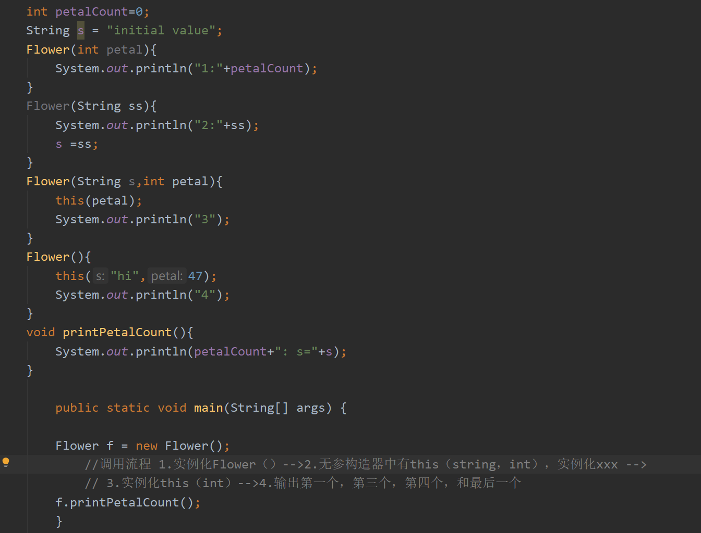

11# 第二章：一切皆是对象

## 2.1 用引用操纵对象

- java一切都是对象，操纵的标识符是对象的一个"引用"。（遥控器--电视机）
- 拥有一个引用，并不一定需要有一个对象与其关联。（String s;）此时，创建了一个引用而非对象，无法向s发送消息，s没有与任何事物关联。创建一个引用同时初始化（String s = "ssssdf";）

## 2.2 必须有你创建所有对象

- 用**new**操作符实现新对象的关联：（String s = **new** String("abc");
   $(# 这行代码究竟创建了几个String对象呢）$

   答：一个或两个

  - 首先在堆中（不是常量池）创建一个指定的对象"abc"，并让s引用指向该对象
  - 在字符串常量池中查看，是否存在内容为"abc"字符串对象
    - 若存在，则将new出来的字符串对象与字符串常量池中的对象联系起来
    - 若不存在，则在字符串常量池中创建一个内容为"abc"的字符串对象，并将堆中的对象与之联系起来

- 寄存器：速度最快，空间最小。
- 栈:在RAM中，通过指针上移，释放资源，下移加入资源，有较大局限性（必须知道所有项的生命周期），一部分java数据存在栈中（对象的引用），但对象不存在栈中
- 堆： 位于RAM中，用于存放java的对象，编译器不需要知道对象存活时间，有较大灵活性。
- 常量存储 常量值直接放在程序代码内部
- 非RAM存储 数据完全存活于程序之外。如，流对象（字节流）和持久化对象（磁盘）。对象可以转化成可以存放在其他媒介上的十五在需要时可以恢复成常规的基于RAM的对象（使用JDBC，Hibernate）

## 2.3 永远不要销毁对象

- 作用域(scope)：
作用域里定义的变量只可作用于作用域结束之前。Java不允许将一个较大作用域的变量"隐藏"起来的做法。
- 对象的作用域：
Java对象不具备和基本类型一样的生命周期。当用new创建一个Java对象时，它可以存活于作用域之外。
    ```
    String s = new String("xxx");
    ```
    引用s在作用域终点消失，但是s指向的**String**对象任继续占据内存空间。

    并且使用Java垃圾回回收期，来监视用new创建的所有对象，消除内存泄漏问题。

## 2.4 方法、参数和 返回值

Java中的方法只能作为类的一部分来创建。方法只有通过对象才能被调用，且这个对象必须能执行这个方法调用。#（static方法：针对类调用，不依赖于对象存在）

参数列表指定要传递给方法什么样的信息。在参数列表中必须指定$\color{red}{每个所传递对象的类型及名字}$，并且与Java中任何传递对象的场合一样，传递的实际上是 ***对象的引用***。

static关键字：
    
    1.只想为某特定域分配单一空间，而不考虑究竟创建多少对象，甚至可以不创建对象
    2.希望某个方法不与包含它的那个类的任何对象关联在一起

当声明一个static类时，表示该域或方法不会与包含他的哪个类的任何对象实例关联。$\color{green}{即使从未创建某哥类的任何对象或方法，也可以调用其static方法或访问域}$

```
class StaticTest{
    static int i = 1;
}

StaticTest t1 = new StaticTest();
StaticTest t2 = new StaticTest();
```
创建了两个static对象，但是t1.i与t2.i共享同一份空间（验证hashcode一致）即指向相同。

引用static变量：1.通过对象定位
2.通过类名直接引用，对于非静态成员不可。如
```
t1.i++;//由于共享空间，改变之后静态变量值全变，t1，t2都+1
```

# 操作符

- ！=和==比较的是对象的引用。若想比较对象的实际内容是否相同必须使用：equals()/此方法不适用于基本类型。
  
    $\color{red}{equals()方法的默认行为是比较'引用'，若比较基本类型会出现错误，使用前必须重写equals()}$（不过大多数类库已经实现重写操作）
- 在Java中，不可将一个非布尔值当作布尔值在逻辑表达式中使用，例如10&&8，即只有布尔值可以执行逻辑操作运算(&&，||，！)。
- **按位操作符**：用来操作整数基本数据类型中的单个"比特(bit)"。即二进制。按位操作符会对两个参数中对应的位执行布尔代数运算，并生成结果。

    按位操作符具有逻辑操作符相同的效果，并且不会出现"短路"。异或操作符不包括在逻辑操作符内
    按位操作符|逻辑操作符|值
    -|-|-
    &|&&|与
    \||\|\||或
    ~|!|非
- 位移操作符：操作二进制，只可以用来处理整数类型。(都可以理解为小数点的左右移)

  左移位操作符(<<):能按照操作符右侧指定的位数将操作符左边的操作数向左移动(低位补0).
  
  右移位操作符(>>)：操作符右侧指定的位数将操作符左边的操作数向右移动。有符号数右移位操作符使用符号补位(补码)，Java特有无符号右移操作符(>>>)，无论正负高位补0.
- 字符串操作+和+=：

    **字符串运算规则**：若括号内存在字符串则将整体当作字符串操作，但是内部出现括号时，以括号为优先级先进行运算。
    ```
    print(""+x)；
    ```
    空String+基本类型变量--->等于显式的Integer.toString()方法执行字符串转换。

**$\color{red}{注意：Java中不会自动的将int数值转换成布尔值，所以while(x=y)是语法错误}$**

## 第五章：初始化与清理

### 5.1 构造器确保初始化

在Java中，通过提供构造器，类的设计者可以确保每个对象都会初始化。创建对象时，如果右构造器，**$\color{red}{Java就会在用户有能力操作对象之前自动调用相应的构造器}$，**从而保证了初始化的进行。

使构造器名称采用与类相同的名称：

    1.防止构造器名称与其他类名冲突。
    2.使编译器一起知道应该调用某个方法。
构造器可以确保在操作对象之前，已经恰当初始化（默认构造器，即无参构造器或空构造器也是必须的）

**注意**：构造器是一种特殊的方法，没有返回值，但与返回值为void的方法不同。

### 涉及基本类型的重载

小-->大（自动完成，转换为存在的类型中最小的类型）
大-->小（必须在转换前强制转换）

### 5.3 默认构造器

- 如果类中没有构造器，则编译器会自动创建一个无参构造器。若已经定义了任意一个构造器，编译器不会。

### 5.4 this关键字

- 希望在方法内部获得对当前对象的引用。使用this关键字，该关键字只能在方法内部使用，表示：“调用方法的那个对象”。
- 在构造器中调用构造器：其实就是依次实例化
  

- static内部没有this，static可以在没有实例化的前提下，仅通过类本身调用。

### 5.5 清理

- Java对象并非总是被垃圾回收：

    0.finalize()不能作为通用的清理方法
    
    1.对象可能不被垃圾回收
    
    2.垃圾回收不等于"析构"
- 垃圾回收只与内存有关

### 5.6 成员初始化

Java尽力保证所有变量在使用前都能得到恰当的初始化。对于方法的局部变量，未初始化会报错。

数据基本类型和一定义的一个类的引用除外(本身有默认初值)

### $\color{red}{5.7 构造器初始化}$

-初始化顺序
 在类的内部，变量(对象实例)定义的先后决定了初始化的顺序。即使变量散布在方法任何地方，他们都会在构造器启动之前完成初始化。
- 静态数据的初始化(构造器可以看成静态方法)
  $\color{red}{无论创建多少个对象，static数据只占用一份存储空间。}$静态初始化只有在必要时可才会进行，只有在第一次访问静态数据的时候，才会被初始化，此后改静态对象不会再次被初始化。

  初始化顺序：静态对象--->非静态对象
 
### 5.8 数组初始化

  如果创建一个非基本类型数组，那么就创建了一个$\color{red}{引用数组/数组中使类的引用}$，只不过刚建立的时候引用对象都是null，一定要创建显得对象在内。
  
  采用花括号的形式来初始化列表对象，有两种形式，我们选第二中，可以在任何地方使用。
  ```
  Interger[] b = new Integer[]{2,3,new Integer(1)}
  甚至可以创建一个S听、对象书，将其传递给另一个卖main方法
  Other.main(new String[]{"xx","sss",})
  ```
  
- 可变参数

    ```
    可以直接传入一串对象，或基本类型。编译器会自动包装成数组
    使用print(Object...args)作为参数
    另外编译器会自动将基本类型升格为包装类
    ```
    **注意**：如果函数只使用一个可变参数，可能会使重载的过程变得混乱，最好传入一个不可变参数来辅助。

    ```
    例如：
    void print(Integer...args)--->void print(Integer i,Integer...args)
    ```

- **枚举类型**

当创建枚举类型enum后，系统会自动添加一些特性，如toString()方法，方便显示实例名。ordinal()方便表示常理啊ing顺序，以及xxx.value()产生枚举值的列表，可以以xx类型遍历。

  枚举类型可以直接和switch(enum)搭配使用。

# 访问控制权限

  public

  protected

  默认权限(包权限)

  私有权限

---
  当编写一个Java源代码文件时，此文件通常被称为编译单元。每个编译单元都必须有一个 **.java**文件，在编译单元内可以有一个Public类，该类的**名称必须与文件的名称相同**。每一个编译单元都只能由一个public类，其他类为public类提供支持。

  **如果不希望其他任何人对该类拥有访问权限，可以把所有的构造器都指定为private，阻止直接通过构造器创建该类**。

  *但是有例外*：在该类的内部可以用static方法静态创建该类，然后返回该类。通过调用静态方法获得该类的实例。

# 第七章：复用类

1.在新的类中产生现有类的对象。由新的类是由现有类的对象所组成，所以称为**组合**。

2.按照现有类的类型创建新类。**继承**

**每个非基本类型类都有一个toString()方法，当编译器需要一个String而你只有一个对象时，该方法会被调用。**

**初始化引用的位置**：

1.在定义对象的地方。这意味着他们总使能够在构造器被调用之前被初始化

2.在类的构造器中

3.就在正要使用这些对象之前，**惰性初始化**。

## 7.2 继承语法

创建一个类时一定是在继承，不是显式的继承就是隐式继承Object。

$\color{red}{组合是has-a的关系}$，新类是现有类的一种类型，$\color{red}{子类的类型同时也是父类的类型(向上转型)}$

由导出类转型成基类，是从一个较专用的类型向通用的类型转换，因此总是安全的。即，导出类是基类的一个超集。

可以为每个类都创建一个main（）方法。在每个类中都设置一个mian()方法的技术是每个类的单元测试变得简便。

```
    class jilei{
        public void c1(){
            System.out.println("123");
        }
    }

public class jicheng extends jilei{
    public void c1(){
        System.out.println("456");
        super.c1();
    }

    public static void main(String[] args) {
//        jilei jl = new jilei();
//        jl.c1();
        jicheng jc = new jicheng();
        jc.c1();

        output：
        456
        123
```

$\color{red}{super}$:要理解这个super表示超类的意思。在上述代码中，执行jc.c1()先输出456，后输出123，说明执行了c1内部的语句后，根据super.c1右执行了父类同名方法c1的语句。若在c1中直接调用c1，编译器会认为递归，所以使用super关键字，表示超类，即，执行继承父类的方法。

$\color{red}{在构造器中super就等于该类所继承的父类本身}$：对于含餐的基类，我们使用super（i）向父类传参初始化。例如

```
class Game{
    Game(int i){
        System.out.prinln(i);
    }
}
class BigGame extends Game{
    spuer(i)// 必须先为Game基类构造器初始化，因为继承是先构造基类。不然会失败
    System.out.println(“xxx”)
}
```

## 7.2 代理

继承与组合的中庸之道。

组合：创建两个分离的类，在一个类中引用另一个类

继承：在基类外部创建一个大类包裹基类。$\color{red}{组合是is-a的关系}$

代理：在代理类中创建某功能的类，调用类的一些方法以获得该类的部分特性。
**用处**：需要使用基类的方法，但又不想暴露所有方法。

例如：飞机控制类，我不想暴露太多飞机控制的功能，只需部分前进左右转的控制（而不需要暴露发射导弹功能）。通过在代理类中new一个飞机控制对象，然后在方法中添加飞机控制类的各个需要暴露的功能。

```
public class PlaneDelegation{
     private PlaneControl planeControl;    //private外部不可访问
     /*
      * 飞行员权限代理类，普通飞行员不可以开火
      */
     PlaneDelegation(){
         planeControl=new PlaneControl();
     }
     public void speed(){
         planeControl.speed();
     }
     public void left(){
         planeControl.left();
     }
     public void right(){
         planeControl.right();
     }
 }

 final class PlaneControl {//final表示不可继承，控制器都能继承那还得了。。
     protected void speed() {}
     protected void fire() {}
     protected void left() {}
     protected void right() {}
 }

```

## 7.5 protected关键字

在项目中我们想将某些事物尽可能的隐藏起来，但仍然允许子类的成员访问他们。ptotected：就类用户而言，这是private，但对于任何一个继承于此父类的类或同一个包内的类都是可见的(也提供包内访问权限)。

## 7.6 final关键字

### 7.6.1 final、数据

向编译器告知某类数据是恒定不变的。在Java中，这类常量必须是基本数据类型，并且以final关键字表示，在对这个常量定义的时候不一定对其赋值（***空白final***）但是在使用前必须初始化。

一个既是static也是final的域(*习惯大写*)，只占一段不能改变的存储空间。

**当final运用在对象的引用的时候**：对于基本类型，final使数值恒定不变，而对于对象的引用，final使引用很定不变。即，一旦引用被初始化指向一个对象，就无法把他改为指向另一个对象。***但是对象本身使可以修改的，只是引用恒定***。

Java允许在参数列表中以声明的方式将参数指明为final：在方法中，参数列表存在final引用，那么在该方法内，无法改变引用所指向的对象。即**无法被重写**。

### 7.6.2 使用final方法的原因

- 把方法锁定，以防止任何继承类修改它的含义。
- 性能，现在不用了。在现在的java中，应该让编译器和JVM去处理效率问题，只有在想要明确禁止覆盖时，才将方法设置为final。
  
**类中所有的private方法都隐式的指定为final**(无法取用private，也就无法重写)，可以对private增加final，但此操作无任何意义。

***注：***没有@override注解时，在继承中覆写final方法(private隐含final)并不会报错，实际上时重新创建了一个同名方法。实际上继承内不会加载private的方法。private不是基类的向外暴露的接口。

### 7.6.3 final类

将final关键字放在类前，将类整体定义为final时，该类无法被继承，即该类永不需要被变动，或不希望拥有子类。**并且final类中的所有方法都隐式的指定为final方法。**

## 7.7初始化及类的加载

Java中所有的事物都是对象，每个类的编译代码都存在于他自己的独立文件中。该文件只在需要使用程序代码时才会被加载。***类的代码在初次使用时菜价在***=加载发生于创建类的第一个对象之时，但当访问static时也会加载，又因为：

***类的构造器时隐式的static，所以更准确的将，类是在其任何static成员被访问时加载的***

## 7.8 总结

继承和组合都能从现有类型生成新类型，组合一般是将现有类型作为新类型底层实现的一部分来加以复用，而继承复用的时接口。

使用继承时，因为导出类具有基类的接口，因此它可以向上转型至基类。***但是***，尽管面向对象对继承极力强调，但是一般优先选择组合或者代理，必要时才使用继承。

# 第八章 多态

继承允许对象视为他自己本身的类型或其基类的类型来加以处理，它允许将多种类型(从同一基类导出)视为同一类型来处理，这样同一分代码可以无差别的运行在同一类型之上。

## 方法调用绑定

将一个方法调同一个方法主体关联起来被称作绑定。

- 若在程序执行前进行绑定，前期绑定
- 在运行时根据对象的类型进行绑定：后期绑定(动态绑定或运行时绑定)。若想实现动态绑定，必须具有某种机制，能再运行时能判断对象的类型，从而调用恰当的方法。

**Java中除了static和final方法，其他都是后期绑定**。所以将某个方法声明为final可以关闭动态绑定，编译器就不需要判定对象类型，从而增加效率(实际没啥)。

## 产生正确行为

因为java中非final，static方法都是动态绑定实现多态，我么可以编写只与基类打交道的程序代码，并且这些代码对于所有的导出类都可以正确运行。我们只需要将消息发送给对象，由对象自己判断做什么。

### 多态的缺陷：域与静态方法

1.只有普通的方法调用可以是多态的。但一般不会出现

2.静态方法不具有多态性。静态方法可继承可覆写，但是使用多态使只会显示父类方法。

静态方法只与类而非单个对象相关联。

## 构造器和多态

构造器本质使static方法，所以其并没有多态性之。

**构造器的调用顺序**：基类的构造器总是在导出类的构造过程中被调用，而且按照继承层次逐渐向上链接。因为导出类通常只能检查自己类中成员，不能访问基类成员(private)，只有基类的构造器才具有权限对内部成员初始化。

**继承和清理**：通过组合和继承的方法来创建新类，不需要担心对象的清理问题，子对象留给垃圾回收器处理。

对于清理：销毁的顺序应该和初始化顺序相反：意味着与声明顺序相饭；先清理导出类，在清理基类。

***构造器内部的多态方法的行为**：

<font color="red">***初始化实际过程:***</font>

1. 在其他任何事物发生之前，将分配给对象的存储空间初始化成二进制零。
2. 如前所述那样构造基类构造器。此时，调用被覆盖后的draw()方法，由于步骤1的缘故，我们会发现radius=0.（P.163）
3. 按照声明顺序调用成员的初始化方法
4. 调用导出类的构造器主体

### 协变返回类型

协变返回类型：在导出类中的被重写的基类方法可以返回基类方法的返回类型。

### 向下转型与运行时类型识别

向上转型使安全的，只是可能会丢失方法。

我们必须要有某种方法来确保向下转型的正确性。(RTTI)运行时类型识别，java自带。向下转型错误时抛出异常。

# 9.接口

接口和内部类为我们提供了一种将接口与实现分离的更加结构化的方法。

## 9.1 抽象类和抽象方法

抽象类使普通的类和接口之间的中庸之道。
为Java提供一个机制：为类的所有导出类创造一个*通用接口*。该方式叫做**抽象方法**，这种方法是不完整的；仅有声明而没有方法体。

    abstract void f();
包含抽象方法的类叫做**抽象类**；如果一个类包含一个或多个抽象方法，那该类必须被定义成**抽象类abstract。**

<font color="blue">**但是，抽象类中的方法并不全是抽象的**</font>,将需要抽象的方法抽象即可。

如果一个类继承于抽象类，并想创建改新类的对象，则必须为基类中所有的抽象方法提供方法定义。如果不这么做，那么导出类也是**抽象类**，并且必须加上abstract关键字。

## 9.2 接口

interface关键字使抽象的概念更进一步。abstract关键字允许在类中创建一个没有方法体的方法(向外的接口)，这些方法的实现是由继承者创建的。

interface关键字使产生一个完全彻底抽象的类，完全不提供具体实现。允许创建者确定，**方法名、参数列表和返回类型**但是没有任何方法体。接口只提供形式，不提供任何实现。

<font color="red">**接口默认权限为public**</font>

interface允许类似多重继承的实现(Java中没有多继承)，同一个类可以实现或者说继承多个接口。

## 9.3 完全解耦

以接口的方式同一相似的任务，将接口和更多的不同的具体实现类联系起来

## 9.4 接口的多重继承

若知道某事物应该成为一个基类，那么第一选择是定义为接口。

## 9.5通过继承来组合接口

- 组合接口是的名字冲突：不要再将会组合在一起的接口中使用相同的方法名，会造成混乱。**方法的重载仅通过返回类型使区分不开的。**
  
## 9.6 适配接口

**允许同一个接口具有多个不同的实现**：一般情况下是一个方法，该方法接受一个实现了的接口类型的类。此时这个接口的实现和像这个方法传递的对象都由程序员决定。

**策略模式**：编写一个执行某些操作的方法，该方法接受一个实现了指定**接口**的对象。(可以使用任何想要使用的对象来调用方法，只要这个对象遵循指定接口)

P388代理模式，<font color="red">接口作为方法参数的情况是很常见的，经常会碰到。当遇到方法参数为接口类型时，那么该方法要传入一个接口实现类对象</font>

我们可以通过同时继承一个类和实现一个接口来适配一个类，这促使我们可以在任何现有类之上添加新的接口。

例如只要继承Readable接口，就可以成为Scanner对象的输入

## 9.7 接口中的域

**放入接口中的任何域都是自动final和static的**，所以接口很方便创建常量组。

## 9.8 嵌套接口（估计没什么卵用..）

## 9.9 接口与工厂

接口是实现多重继承的途径，生成遵循某个接口的对象的典型模式就是*工厂方法*设计模式。

# 第十章 内部类

可以将一个类的定义放在另一个类的定义内部。

最普通的情况：单纯将一个类放在一个大类之内，类似组合。

**典型情况**：外被类有个方法，该方法返回一个指向内部类的引用。如果想从外部类的非静态方法之外的任意位置创建某个内部类的对象，必须具体指明这个对象的类型：OuterClass Name.InnerClassName。

## 10.1 链接到外部类

<font color="blue">当生成一个内部类对象时，此时对象与制造他的外围对象之间有了联系，</font>
他能访问外围对象的所有成员，而不需要任何特殊条件。内部类拥有外围类所有元素的访问权限。
<font color="blue">内部类能访问其外围类的方法和字段，不论权限。 </font>

## 10.2 使用.this和.new

如果要声称对外部类对象的引用，可以使用OuterClass.this，这样产生的引用自动具有正确的类型。

说白了，就是在内部类中使用OuterClass.this就会自动生成对应OuterClass外部类的引用，此时可以直接调用外部类的方法。（调用.this时候，程序又回到外部类中使用方法）

如果外部类中没有内部类的工厂方法(new InnerClass)，则在使用内部类时必须在main中new内部类。我们使用

    OuterClass.new InnweClass();
方式，其他照旧。不能直接new内部类名字，需要引用外部类的对象来创建改内部类对象。

所以，在拥有外部类对象之前是不可能创建内部类的，内部类必须隐式链接到外部类。

**但是静态内部(嵌套类)类除外。**，静态内部类不需要通过外部类的对象创建。<font color="red">静态内部类当外部类创建时自动创建，有且仅创建一次</font>

## 10.5 在方法和作用域内的内部类

可以在方法里面或者在任意的作用域内定义内部类：

1. 实现某类型的接口，可以创建并返回对其的引用
2. 解决复杂问题，可以创建一个类来辅助解决，但又不希望这个类是公共课用的

后面的例子：

    1.一个定义在方法中的类
    2.一个定义在作用域的类，此作用域在方法内部
    3.一个实现了接口的匿名类
    4.一个匿名类，它扩展了有非默认构造器的类。
    5.一个匿名类，他执行字段初始化
    6.一个匿名类，它通过实例初始化实现构造（匿名类不能有构造器）

- 局部内部类：放在一个外部类中一个方法的作用域中。有效范围**仅在有效的作用域内**，比如方法中，或者循环体，判断体中。

## 10.6 匿名内部类

- 匿名内部类在return之后

        return new Contents(){xxx};
        返回一个类的引用，该类继承于Contents并且向上转型为Contents。
- 有参构造器的匿名内部类

        OutClass(int x){
            return new Contents(x){xxx};
        }；
        只需要简单的从外部类传入构造器的默认参数即可
        此方式也可以给匿名内部类中的属性赋值，但是，将要在内部类中使用的参数必须是final型
- 匿名内部类末尾的分号不是用来标记内部类的结束，而是表示表达式的结束。
- 匿名内部类本身没有构造器，但是通过**实例初始化**的方式可以达到构造器的效果。

        比如，返回的匿名内部类继承于一个抽象类，该抽象类拥有构造方法。
        或者说可以从外部类传入final型参数为内部类的属性赋值。

## 10.7 嵌套类

  如果不需要内部对象与外部对象有联系，可以将内部对象设置为static，此时被称为**嵌套类**。此时内部类对象不会隐式保存一个指向外部的引用：

        1.要创建嵌套类的对象，不需要其外部类的对象
        2.不能从嵌套类的对象中访问非静态的外围类对象。
        3.普通内部类的字段和方法只能放在外部层次上，不能有static数据和字段。但是嵌套类可以。

## 10.8 我们为什么需要内部类（2019-12-22）

# 第十一章 持有对象

由于程序可能随时随地任意数量的创建对象，不知道确切类型，Java实用类库提供了容器来解决这个问题。基本类型是**List、Set、Queue、Map**（集合类），通常用容器称呼。

## 11.1 泛型和类型安全的容器

ArrayList:这个容器中保存的是Object，可以添加进任何对象，当从ArrayList中去除对象时，**得到的只是Object对象的引用**，必须要转型为对应的类型。

针对上面的加入任意对象，我们可以预定义的泛型类型(Java泛型创建类会很复杂)。例如**ArrayList\<Apple>**,尖括号括起来的是参数类型，可以有多个。此时从容器中取出对象时不需要转型，编译器清晰的知道，是什么类型。

- **Object有默认的toString方法，该方法的默认操作就是打印类所对因的hashCode**

## 11.2 基本概念

1. Collection。序列的概念：一个独立元素的序列，服从一条或多条约束。List/Set/Queue
2. Map。一组成对的键值对对象，允许按键查找值。ArrayList允许用数字查找值，某种意义上讲是将数字与对象关联在一起。

        List<Apple> apples = new LinkedList<Apple>();
    一般情况下都可以用上述代码创建List，此时Apple被向上转型为**List**，但是这种方法不能完全奏效，当我们需要调用子类的特用方法时不能简单地向上转型。**例如**：TreeMap中包含有Map没有的方法，如需使用这些方法，就不能向上转型为通用接口。

## 11.5 List

List接口在Collection的基础上添加大量的方法，是的可以在List的中间插入和移除元素。

1. ArrayList，适合随机访问，不适合在中间插入删除。数组型
2. LinkedList，链表型。不适合随机访问(查)，适合增删

**List的方法都在P225**

## 11.6 迭代器

任何容器类，都必须有某种方式可以插入元素并将他们再次取回。对于List，add()是插入元素的方法之一，get()是取出元素的方法之一。

但是这种方法存在缺点：要使用容器，必须对容器的确切类型编程。那么如何不重写代码而应用于不同的容器？

**迭代器**设计模式：迭代器是一个对象，他的工作是遍历并选择序列中的对象，程序员不需要关心序列的底层结构。此外迭代器通常被称作*轻量级对象*:创建它的代价小。

Java的迭代器(Iterator)只能单项移动：

1. **使用iterator()方法要求容器返回一个Iterator**```Iterator<Pet> it = pets.iterator();```，Iterator将准备好返回序列的第一个元素
2. 使用next()获得序列中的下一个元素
3. hasNext()检查序列中是否还有元素
4. remove()将迭代器当前获取的元素删除

***应用***：对于迭代器我们可以不考虑容器的确切类型而重用同一段代码来处理容器中的对象。例如：**写一个方法传入迭代器参数**，任何调用该方法的容器都可以执行操作。
***迭代器能将遍历序列的操作与序列底层的结构分离***

### 11.6.1 ListIterator迭代器

ListIterator是一个更加强大的Iterator子类，**只能用于List**类的访问。Iterator只能单向向前移动，ListIterator可以双向移动，可以产生迭代器当前对象的前后对象的索引，并且可以使用set()方法替换从当前访问位置开始之后的元素。

1. listIterator()方法产生一个指向List起点的ListIterator，并且可以通过listIterator(n)，产生一个执行第n个位置ListIterator，然后从第n个位置开始遍历。

## 11.7 LinkedList

LinkedList还添加了可以使其用作栈、队列、双端队列方法。**在这些方法中只是彼此名称有少许差异，实际作用甚至可能完全一致。**

例如：getFirst()=element()返回列表头，若不存在抛出异常。peek()方法也返回列表头，不存在则返回null。

removeFirst()=remove()返回并移除列表头，不存在抛异常。pull()返回null。

addFrist()=addList()将某个元素插入末尾。

removeList()意出并返回列表最后一个元素。

## 11.8 Stack P229

栈：先进后出 。LinkedList具有实现栈功能的所有方法(push/pop/peek)，可以把他当栈使用。只需要写个栈类。

## 11.9 Set P231

Set不保存重复的元素。Set最常被使用的是测试归属性，可以很容易的查询某个对象是否在Set中。因此**查找是Set中最重要的操作**。-->HashSet

Set具有与Collection完全一样的接口，没有额外的功能，只是行为不同(继承和多态的应用)。Set基于对象的值判断归属性。

## 11.10 Map P233
搞懂List,List<Object>,List<?>的区别以及<? extends T>与<? super T>的区别:(https://www.cnblogs.com/minghaiJ/p/10685930.html)

## 11.11 Queue

队列是一个典型的先进先出的容器。容器的放入顺序和取出顺序是一致的。队列通常被当作一种可靠的对象从程序的某个趋于传输到另一个区域的途径。**队列在并发中特别重要**，它可以安全的传输对象。

LinkedList提供了支持队列的方法，实现了队列的接口。通过将LinkedList向上转型为Queue:

```Queue<Integer> queue = newLinkedList<Integer>();```

offer()是Queue相关方法，建一个元素插入到队尾，失败返回false。peek(),element()在不移除的情况下返回队头。poll()，remove()移除并返回队头。

### 11.11.1 PriorityQueue

常规先进先出队列声明的是下一个元素应该是等待时间最长的元素。

而**优先级队列**生命下一个弹出的是最需要的元素(拥有最高优先级)。例如建立一个消息系统，某些消息最重要，因而应该得到更快地处理，那么他们无论何时到达都应该第一个处理。

PriorityQueue队列调用offer()方法来插入一个对象是，这个对象会在队列中排序。默认的排序是*自然顺序(从小到大)*，我们可以提供**Comparator**来修改这个顺序优先级，此后使用peek，remove时可以保证最先操作优先级高的数据。比较器在创建优先级队列对象时传入(反序，去重等等)。

## 11.12 Coliiection和Iterator，foreach P239

Collection是描述所有序列容器的共性的根接口。foreach可以用于任何Collection对象。

Iterable接口包含一个能够产生迭代器的iteraor()方法，并且Iterable接口被foreach用来在序列中移动，只要创建该接口的实现类，就可以任意使用foreach。

**Foreach语句可以用于数组和其他任何Iterable，但并不意味着数组也是一个Iterable，数组必须手工执行转换**(基本上是不支持可迭代的通用方法)

```
public void bar(Iterable<Foo> foos) { .. }
```

    数组应该支持Iterable，但不应该支持。出于同样的原因，.NET数组不支持允许按位置进行只读随机访问的接口（没有这样的接口定义为标准接口）。从根本上说，框架之间经常存在令人讨厌的小差距，这不值得任何人修复。我们能否以某种最佳方式自己修复它们并不重要，但通常我们做不到。

    更新：为了公平起见，我提到了.NET数组不支持按位置支持随机访问的接口（另请参见我的评论）。但是在.NET 4.5中，已经定义了确切的接口，并由数组和List<T>类支持：

    IReadOnlyList<int> a = new[] {1, 2, 3, 4};
    IReadOnlyList<int> b = new List<int> { 1, 2, 3, 4 };

    由于可变列表接口IList<T>不继承，因此一切还不是很完美IReadOnlyList<T>：

    IList<int> c = new List<int> { 1, 2, 3, 4 };
    IReadOnlyList<int> d = c; // error
    也许通过这种更改可能会向后兼容。

### 11.12.1 适配器方法惯用方法 P243

现有一个Iterable类，如果想要添加一种或多种昂在foreach语句中使用这个类的方法。若是直接继承，重写iterator()只会替换现有方法，不完美。

我们使用**适配器**方法。当我们有一个接口并需要另一个接口时候，我们需要适配器。

# 第十二章 异常处理
发现错误的理想时机是在编译阶段，也就是**试图运行程序之前**。然而编译期间并不能找出所有的错误，余下的问题必须在运行时解决。错误源能通过某种方式把信息传递给某个接收者，接收者处理错误。

## 12.1 基本异常
异常情形：指阻止当前方法或作用域继续执行的问题。要区分普通问题和异常问题，在当前环境下无法获得必要信息来解决的问题是异常问题，我们自定义编码来解决的问题是普通问题。

    比如：除数为零，如果在代码中我们预先判断除数为零的情况并作出处理，那么这是普通问题。如果没有，此时当前环境无法解决这个问题，抛出异常。

抛出异常之后：
1. 使用new在堆上创建异常对象
2. 当前执行路径被终止，并且从当前环境装弹出对异常对象的引用
3. 异常处理机制接管程序，寻找恰当的地方继续执行程序(就是**异常处理程序**)。

异常使得我们可以将每件事都当作一个事物来考虑，一场可以看护着这些事务的底线。

或者异常可以看作是一种内建的恢复(undo)系统，我们的程序中可以拥有各种不同的恢复点，如果程序的某部分失败，异常将回复到某一个已知稳定点上。

所有标准异常类都有两个构造器：默认构造器；接受字符串作为参数的构造器，以便把相关信息放入异常对象的构造器。
    throw new NullPointer(xxx);
返回异常对象的方式很像return。但是异常返回的地点与普通方法返回的地点完全不同(异常将在一个恰当的异常处理程序中得到解决，他的位置可能离抛出的地方很远，可能会跨越很多层方法调用栈).

## 12.3 捕获异常
理解如何捕获异常，先理解监控区域的概念。他是一段可能产生异常的代码，并且后面跟着处理这些异常的代码。
### 12.3.1 try
如果在方法内部或调用的过程中发生异常，这个方法将在异常中结束。不希望此方法结束，可以在方法内设置一个特殊的块来捕获异常。即
    
    try{
        //xxxx
    }
对于不支持异常处理的程序语言，必须自己在调用方法前后编写检查代码，对于Java吧所有动作放入try中即可。
### 12.3.2 异常处理程序
抛出的异常必须在某处得到处理，即异常处理程序，并且针对不同的异常要有相应的处理程序。异常处理程序紧跟在try之后，一关键字catch表示

    try{

    }catch(Type id1){
        Handler xxxx of type 1
    }catch(Type id2){
        Handle xxx of type 2
    }
每个catch字句是一个有且仅接受一个特殊类型的参数方法。可以在处理程序内部使用标识符 id1，id2等。**标识符不能省略**

异常处理必须紧跟在try之后，当异常抛出时，异常处理机制将负责搜寻参数与异常类型相匹配的第一个处理程序，然后执行catch字句。

异常处理理论上有两种基本模型，Java支持**终止模型**。在这种模型中假设错误非常关键，一旦异常抛出，表明错误无法挽回，也不能回到原处继续执行。

另一种模型是**恢复模型**，异常处理机制的工作是修正错误，然后会回到原处尝试执行。这种模式基本被放弃。
## 12.4 创建自定义异常

## 12.6 捕获所有异常
可以只写一个异常处理程序来捕获所有异常--即异常基类Exception。

Exception是与编程有关的所有异常类的基类，所以不包含详细信息。可以调用其继承于Throwable基类的String getMessage()....

### 12.6.1 栈轨迹
printStackTree()方法所提供的信息可以直接通过getStackTree()方法直接访问。这个方法江将返回一个由栈轨迹中的元素构成的数组。*(就是输出在控制台上的异常信息，从下到上是调用方法的序列)*，即0是栈顶元素，是调用时最后一个被调用的方法，栈底(最后一个元素)时第一个被调用的方法。
### 12.6.2 重新抛出异常(什么意义？)
又是希望把刚捕获的异常重新抛出，尤其是在使用**Expection**抛出所有异常的时候。
```
catch(Exception e){
    SYS.out.println("xxxx");
    throw e;  //在此处重新抛出
}
```
重新抛异常会把异常抛给上一级环境中的异常处理程序，并且当前try中cacth后续不再执行。

### 12.6.3 异常链 P260
在捕获一个异常之后抛出另一个异常，并且保留原始异常信息--异常链。

在所有Throwable的子类构造器中都可以接收一个*cause*对象作为参数，这个对象来表示原始异常信息。

在Throwable中只有三种基本的异常提供了带cause参数的构造器。
1. Error
2. Exception
3. RuntimeException

书中例子可能是：这种异常链可以定义某种情况的错误，抛出编程错误，同时又保留原始错误信息(真正的错误链)。

## **12.7 Java标准异常**（重要）
Throwable可以表示任何作为异常抛出的类。同时他被分为两种类型(从该类继承而得到的类型)
1. Error：表示编译时和系统错误
2. Exception：表示被抛出的基本类型。(一般是，Java类库，用户方法，运行时故障，程序员关心最多的)

**异常的基本想法是用名称代表发生的问题，做到见闻知意**

### 12.7.1 特里RuntimeException
属于运行时异常的类型有很多，他们会自动被虚拟机抛出，不需要在异常说明中罗列出来(比如引用空指针，会抛出NullPointException)。这些异常都从RuntimeException中继承而来，这些异常支持手动抛出但是不需要手动抛出，虚拟机会自动捕获。

只能在代码中忽略RuntimeException及其子类的异常，其他类型异常的处理都是由编译器强制实施的，究其原因是RuntimeException代表**编程错误**：
1. 无法预料的错误。比如被传递的null引用
2. 应该在代码中进行检查。

## 12.8 使用finally进行清理
对于一些代码，希望无论try块中的一场是否抛出都能得到执行。为了达到这个效果，可以在异常处理程序后 **（不一定在cacth后）** 加上finally{}子句。无论异是否抛出，finally子句总是执行。
### 12.8.1 finally用来做什么？
对与没有垃圾回收记之和**析构函数**(当对象不再使用时，会被调用的函数)自动调用机制的语言来说，finally很重要，能使程序员保证，无论try发生什么，内存总能得到释放。

**但是对于Java，有垃圾回收机制，所以我们应用在：当要把出内存之外的资源恢复到他们的初始状态时，就会用到finally子句。**

**甚至在异常没有被当前异常处理程序捕获的情况下**，异常处理机制会在跳到更高一层的异常处理之前，先执行finally。
```
try{
    try{
        throw xxx;抛出异常
    }finally{
        //执行字句
    }
}
catch(xxx e){
    //此时才捕获异常
}finally{
    //执行子句
}
```
### 12.8.2 在return中使用finally
因为finally子句总会执行，所以在一个方法中可以从多个点返回，并可以保证重要的清理工作人就会执行。
**<font color="red">意思就是，即便在try中return了，finally还是会执行</font>**
### 12.8.3 缺憾：异常丢失（新版本可能已经改进）
在前一个异常抛出还未处理从情况下抛出第二个异常，可能会出现错误。（第一个异常被第二个顶替）
## 12.9 异常的限制 P270
当覆盖方法的时候，只能抛出在基类方法的异常说明里列出的异常。

## 12.10 构造器
如果异常发生了，所以东西能被正确的清理么？
在构造器中可能会出现问题，当构造器抛出异常时候，，程序初始化都没有完成，finally还无法执行，此时无法处理异常。

例如在构造器中打开一个文件，若打开失败，抛出FileNotFoundException异常。**因为此时这个文件没有打卡，对于这个异常不需要关闭文件**，而任何其他捕获异常的catch子句需要关闭文件，因为此时文件可能已经打开。

**P273，标准开文件的写法**：对于构造阶段可能会抛出的异常，并且要求清理的类，最安全的方式就是使用嵌套的try。

对于构造器，基本规则是：**<font color="red">在创建需要清理的对象（例如链接，文件等），之后立即进入一个try-finally语句块。</font>**
## 12.11 异常匹配
异常抛出的时候，异常处理系统会按照代码的书写顺序找出“最近”的处理程序，找到匹配的处理程序后，就结束异常处理。

查找的时候不要求完全匹配，派生类的对象也可以匹配其基类的处理程序。

## 12.12 其他可选方式 P275


## 12.13 异常使用指南
1. 恰当的几倍处理问题
2. 解决问题并且重新调用产生异常的方法
3. 进行少许修补，然后绕过异常发生的地方继续执行
4. 用别的数据进行计算，以代替方法预计会返回的值
5. 把当前运行环境下能做的事尽力昨晚，然后把相同的异常跑到更高层
6. 把当前运行环境下能做的事尽力昨晚，然后把不同的异常跑到更高层
7. 终止程序
8. 进行简化
9. 让类库和程序更安全

# 第十三章 字符串
## 13.1 不可变String
String对象是不可变的。实际上String类中每个看起来会修改Strig值的方法都是创建了一个新的String对象。例如：
    ```
    String a = "acb";
    String A = upcase(a);
    ```
    实际上a的引用没有变化，只是重新返回了一个A表示大写
## 13.2 重载"+"与StringBuilder
String对象是不可变的，可以给一个String对象加任意多的别名。**String对象具有只读特性,**指向它的任何引用都不可能改变它的值。

但是，不可变性会带来效率问题。例如简单的重载”+“操作符
```
String a = "a"+"b"+"B";
```
上面这条代码，实际上在JVM编译器编译(javap 反编译得到)时，会自动引入StringBuilder，然后调用append()方法来拼接字符串。

所以在较为简单的拼接操作何以直接写”+“，性能不损失。

**但是对于存在字符串修改操作在循环体内的，不要再使用简单的String拼接。自己new一个StringBuilder对象，使用append（）方法**

**<font color="red">详情见P285，在JVM编译时，String拼接方式会被放入循环体，于是每次循环都会新建一个StringBuilder，严重浪费效率</font></font>**，因此如果为一个类编写toString()方法时候，如果字符串操作复杂最好自己穿件StringBuilder。

另外，显式的创建StringBiluder允许预先指定大小，如果已经知道最终字符串大概有多长，预先指定可以避免多次重更新分配**缓存**。

StringBuilder拥有丰富的方法，插入，替换，字串，反转，添加，toString(继承于Object)

## 13.3 无意识的递归
Java中每个类都继承于Object，因此容器类都有toString()方法，并且重写了该方法，使得它生成的Strig结果能够表达容器自身，以及容器所包含的对象。例如**ArrayList.toString()，会遍历内部包含的所有对象，并调用该对象的toString()方法**

System.out.print（）；会自动调用toString（）；

如果想打印内存地址，可以重写toString(),并且***使用super.toString();***,因为应该调用Object，this会出错P287.
## 13.4 String上的操作
P288

## 13.5 格式化输出
### 13.5.1 System.out.format()
dormat方法可以用于PrintStream或PrintWriter对象，其中也包括System.out对象，format方法模仿C的printf()，说白了就是可以用占位符的形式输出。

即```System.out.printl()=System.out.format() ```
format和printf是等价的。
### 13.5.2 Foramtter类
Java中所有的新的格式化功能都有Foramatter类处理，类似于翻译器，将我们的数据翻译成需要的结果。

当创建一个Fomatter对象的时候需要向其构造器传递一些信息，指明结果将输出到哪里

```
class a{
    private f;
    public T(Formatter f){
        this.f = f;
    }
}
new a(new Formatter(System.out))；
这条的意思是，输出在控制台。
```

<font color="red">Formatter类经够重载可以指定输出到多种目的地</font>

### 13.5.4 格式化说明符

插入数据时，控制与空格对齐。惊喜而复杂的格式修饰符。
**P291**

### 13.5.5 Formatter格式转换和String.format()

**P292-296**
格式转换

```
Formatter f = new Formatter(System.out);
f.format(转换类型，被转换的对象)；


//注意，java中不会讲int值转换为布尔值，所以format也不行
具体见书
```

String.formatter()方法是一个static方法，实际效果和上面的一样，并且内部实现就是上面代码，不过简单使用转换的时候静态方法更方便。

## 13.6 Java正则表达式见《正则指引》

## 13.7扫描输入
对于一个字符串，我们一般使用String.reader();把String变成可读的流对象，然后使用这个对象来构造BufferReader对象，最后使用readLine()方法，一行一行读取。

但是对于readLine()方法，若是一行中存在多个有用的值，必须使用分解操作...

**此时可以使用Scanner类**，该类可以减轻扫描输入的工作负担。Scanner的构造器可以接受任何类型的输入对象，包括**File对象，InputStream，String或者Readable对象(任何实现Reable接口，重写read()方法的类)**。

有了Scanner所有的输入、分词以及翻译操作都隐藏在不同类型的**next方法中**：*普通的next()返回String，nextLine()返回一行，nextInt()接下来的第一个整形...*，除char外的所有基本类型都有对应的next方法。另外还包括一个**hasNext()方法**，用以判断下一个输入分词是否指定类型，返回布尔值。
### 13.7.1 Scanner的定界符(分词)
默认清理，Scanner根据空白字符对输入进行分词，也可以指定正则表达式自定义边界。
```
Scanner scanner = new Scanner("xxxxxx")；
scanner.useDelimiter("正则表达式")；
```
### 12.7.2 P311，使用正则表达式扫描


# 第十四章 类型信息
**运行时类型信息使得你可以在程序运行时发现和使用类型信息。**
本章讨论Java是如何让我们在运行时识别和类的信息的。主要使用两种方式：
1. RTTI，假定编译时已经知道所有的类型
2. 反射机制，它允许我们在运行时发现和使用类型。
---
## 14.1 为什么需要RTTI
面向对象编程中基本目的是：让代码只操纵对基类的引用。这样，如果要添加一个新类来扩展程序，就不会影响源代码。

RTTI的基本使用形式：在运行时检查所有的类型转换的正确性。即，在运行时，识别一个对象。

通常，希望大部分代码尽可能的少了解对象的具体类型，而只和对象家族重得通用对象打交道，具体的实现由多态来搞定。
## 14.2 Class对象
要理解RTTI在Java中的工作原理，先了解类型信息在运行时是如何表示的。
这项工作是由称为**Class对象**的特殊对象完成的，它包含了有关类的信息。

<font color="red">事实上，Class对象就是用来创建类的所有的常规对象的</font>，Java使用Class对象来执行RTTI，即使正在执行的是类似转型的操作。

**类是程序的一部分，**每个类都有一个Class对象。为了生成这个类的对象，运行这个程序的Java虚拟机将使用被称为**类加载器**的子系统。

类加载器：实际上包含一条类加载器链，但是只有一个*原生类加载器*，他是JVM实现的一部分。原生类加载器加载的都是所谓的*可信类*，包括JAVA API类，通常从本地盘加载的，这种情况中不需要额外添加类加载器。除非有额外的需求(网络等)，需要外挂类加载器。

**所有的类都是在第一次使用时，动态加载到JVM中**。当程序创建第一个对类静态成员的引用时，同样会加载该类。构造器就是静态方法--->因此使用new操作符创建对象也会被当作对类的静态成员的引用。

类加载器首先检查这个类的Class对象是否加载，如果尚未加载，则默认的类加载器就会根据类名查找 **.class**文件，载入。**Class对象只有在需要的时候载入**

```Class.forName()```是Class调用一个静态方法，获得某一个对象的**引用**。也可以使用他的副作用：如果某类没有加载，那就加载他。**相当于对某类执行了默认构造器方法。**

无论何时，只要想在运行时使用类型信息。都可以使用forName()，来加载类，并且不需要持有该对象的引用。另外也可以使用getClass获得这个引用。这俩引用的是一个东西

**注意**：getClass()和forName()都是用来获取Class对象引用的函数，他们返回同一个Class对象的引用。不同的是getClass()函数是Object对象的方法，如使用此函数，需要一个对象的引用来调用此方法。forName()函数是Class类中的一个静态方法，参数是全限定名(包名+类名)，会抛出ClassNotFoundException异常，因此调用此函数，需要处理或声明抛出该异常。
```
  public static void main(String[] args) {
        // getClass()需要获取Class对象对应的对象的引用。是根类Objecct的函数
        CompareMethod compareMethod = new CompareMethod();
        Class c1 = compareMethod.getClass();

        Class c2 = null;
        try {
            // forName()是Class类的static方法，参数是全限定名，会抛出ClassNotFoundException异常
            c2 = Class.forName("cn.zh.rtti.CompareMethod");
        } catch (ClassNotFoundException e) {
            System.out.println("not find class");
            System.exit(1);
        }

        // getName()函数是Class类中的一个static方法，返回该Class对象的全限定名字符串
        System.out.println("I'm c1--------- name of class: " + c1.getName());
        System.out.println("I'm c2--------- name of class: " + c2.getName());

        // 通过.equals()函数得出c1和c2两个对象的内容是相同的
        // == 来比较c1和c2的地址，相同，由此得出getName()和forName()函数返回的是同一个Class对象的引用
        System.out.println("compared content between c1 and c2: " + c1.equals(c2));
        System.out.println("compared address between c1 and c2: " + (c1 == c2));
    }
```
 Class的newInstance()的方法是实现"虚拟构造器"的一种途径，虚拟构造器允许声明：不知道确切类型，但是无论如何要正确的创建你自己。**但是使用此方法来创建的类，必须带有默认构造器**，另外，此方法的返回值不是一个精确类型，而只是Object。P322(表示为"某个类，他是xx的超类"。不能直接写超类)

### 14.2.3 类字面常量
Java提供另一种该方法来生成对Class对象的引用---*类字面常量*。例如```Factory.class```即可。同时也可以用于接口，数，基本类型数据等。另外对于基本类型的包装器类还有一个TYPE标准字段```boolean.class==Boolean.TYPE```，字段是一个引用，指向对应class对象。

**注意**：使用“.class”方式创建Class对象的引用的时候。<font color="red">不会自动初始化任何东西，仅创建一个引用</font> 所以使用该方法实际三个步骤
   
      1. 加载，有类加载器完成。
      2. 链接。验证类，为静态域分享空间，如果有需要解析这个类创建的对其它类的所有引用
      3. 初始化。如果该类具有超累，则对其初始化。
      在这种创建方式中，步骤三被延迟。只有在首次引用静态方法或非常数静态域时出现。如果不是静态final域，在引用前会初始化。 
### 14.2.2 泛化的Class引用
P320

### 14.2.3 新的转型语法
基本没用

## 14.3 类型转换前先做检查 p322看不懂!

RTTI的三种形式

1. 传统型，RTTI确保类型转换正确性，如果错误抛出ClassCastException。、
2. Class对象。通过查询Class对象可以获取运行时所需的信息。、
3. 关键字instanceof。返回一个布尔值，告诉我们对象时不是某个特定类型的实例。

   ```
   if(x instanceof Dog){
       执行前会检查对象x是否虫属於Dog类
   }
   ```

jaava要执行类型检查--类型安全的向下转型。

## 14.4 注册工厂 P332 只是一个思想...md要看哭了

工厂方法设计模式。将对象的创建工作交给类自己去完成。工厂方法可以多态的调用，从而创建恰当的类型对象。

```
public Interface Factory<T>{T create();}
泛型T，使得每种工厂实现中返回不同的类型。
```

## 14.5 instanceof与Class的等价性

instanceof是同一个类或基类，就返回true

Class仅考虑自身，不考虑继承关系。

## 反射：运行时的类信息！非常重要

如果不知道某个对象的确切类型，RTTI可以告诉你。但是：这个类型在编译时必须已知，这样才能被识别。

这似乎并没有什么限制，**但是假设获取了一个指向并不在我的程序空间中的对象引用，编译时程序无法知道这个对象所属的类。**例如：从网络或磁盘获取了**一串字节**，并且被告知字节代表类与各类。那么该如何使用？

反射提供了一种检查机制，来检查可用方法。

Class类和java.lang.reflect类库共同支持反射概念。该类库报刊Field；Method；Constructor类。这些类型的对象由JVM在运行时创建的，以表示未知类里面的成员。可以使用Contructor创建新的对象，get()，set()读取和修改Field，invoke()调用Mtehod对象关联的方法.....

当通过反射于一个未知类型的对象打交道，JVM只是简单价差这个对象，看他属于特定的类。在用它做其他事情之前，必须先加载那个类的Class对象。因此，哪个类的.class文件对于JVM来说是可获取的。

RIII和反射之间的区别：对于RTTI来说，编译器在编译时打开和检查.class文件。对于反射机制，.class在编译时是不可获取的，在运行时打开和检查这个文件。

### 14.6.1 类方法提取器

通常不需要直接使用反射工具，但是他们在你需要创建更加动态的代码时会很有用。

## 14.7 动态代理（具体的应该在设计模式）

代理是基恩的设计模式之一。未提供额外的或不同的擦澡做而插入的用来**代替“实际”对象**的对象。这种操作通常涉及与“实际对象”的通信，代理通常充当中间角色。

**动态代理**比代理的思想更进一步，它可以动态的创建代理并动态的处理对所代理方法的调用。在动态代理上做的所有调用，都会被重定向到单一的**调用处理器**上。他的工作室借室调用的类型并确定相应的对策。

通过调用静态方法Proxy.newProxyInstance(),可以创建动态代理。这个方法有三个参数：1.类加载器（可以直接从亦被加载的对象中获取类加载器）2.一个被该代理实现的接口列表(不是类或抽象类)。3.InvocationHandler接口的一个实现。**<font color="red">传入的实现类中所有的方法，会被动态代理拥有。可以直接调用</font>**

动态代理可以将所有调用重定向到调用处理器，因此通常会向调用处理器的构造器传递给一个“实际”对象的引用，从而使得调用处理器在执行其中介任务时，可以将请求转发。

```
invoke(Object proxy, Mwthod metho, Object[] args);
....
return method.invoke(proxy, args);
```

通常，会执行被代理的操作，然后使用Method.invoke()方法把请求转发给被代理对象，并传入必要参数。

我们可以通过在调用处理器中添加限制，来控制或过滤某些方法的执行。

## 14.8 空对象 P341 不知道用途
当你使用内置的null表示缺少对象时，每次引用都必须测试是否为null，这会很麻烦。null出来会抛出空指针异常外无其他行为，此时引入**空对象**的思想就会很有用。

空对象可以接受传递给它所代表对象的消息，但会返回一个值，这个值时实际上并不存在的。

类似一个空对象做占位符，等待后续填充？
##  14.9 接口与类型信息
interface最重要的用处就是允许程序员隔离构件，降低耦合性。但是接口并非是对解耦的一种绝对保障。

**说白了。。反射可以获得一切**